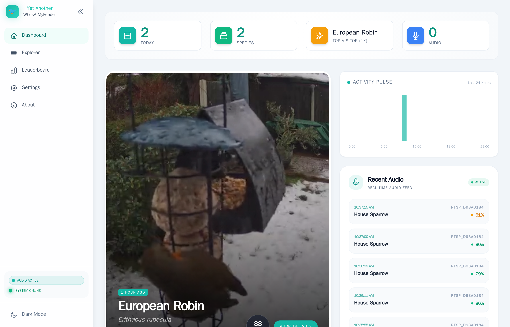

# Yet Another WhosAtMyFeeder (YA-WAMF)

A bird classification system that integrates with [Frigate NVR](https://frigate.video/) to automatically identify birds visiting your feeder using advanced AI models.



## Features at a Glance

- **Advanced AI Classification** - MobileNetV2, ConvNeXt, or EVA-02 models (up to 91% accuracy)
- **Multi-Sensor Verification** - Correlates visual detections with BirdNET-Go audio
- **Smart Notifications** - Discord, Telegram, Pushover, Email with customizable filters
- **Video Analysis** - Automatic frame-by-frame scanning for improved accuracy
- **LLM Insights** - AI-powered behavioral analysis (Gemini/OpenAI/Claude)
- **Home Assistant Integration** - Sensors, automation, and dashboard cards
- **BirdWeather Reporting** - Contribute to community science
- **Real-time Dashboard** - Live updates, video playback, species statistics

## About This Project

A personal project built with AI-assisted coding, inspired by the original [WhosAtMyFeeder](https://github.com/mmcc-xx/WhosAtMyFeeder). When I noticed the original project wasn't being maintained, I saw an opportunity to learn and build something better.

Built with help from AI coding assistants as an experiment in what's possible with modern development tools. Feedback and contributions are welcome!

## Live Instance

A public instance of YA-WAMF is available here:

- **https://yetanotherwhosatmyfeeder.pownet.uk**

## What It Does

When Frigate detects a bird at your feeder, YA-WAMF:
1. Grabs the snapshot image
2. Runs it through an advanced AI model (MobileNetV2, ConvNeXt, or EVA-02)
3. Cross-references with audio detections from **BirdNET-Go** for multi-sensor confirmation
4. **Automatically analyzes the video clip** (optional) for higher accuracy using temporal ensemble logic
5. Sends **rich notifications** to Discord, Pushover, Telegram, or Email (OAuth/SMTP)
6. Enriches detections with local weather data and behavior analysis via **LLMs (Gemini/OpenAI/Claude)**
7. Keeps track of all your visitors in a nice dashboard with taxonomic normalization
8. Proxies video clips from Frigate with full streaming and seeking support
9. Reports detections to **BirdWeather** (optional) for community science contribution

**Advanced Features:**
- **Auto Video Analysis:** Automatically downloads and scans 15+ frames from the event clip to verify snapshot detections.
- **Multi-Platform Notifications:** Native support for Discord, Pushover, Telegram, and Email with customizable filters (species, confidence, audio-only).
- **Accessibility & i18n:** Screen-reader friendly UI, live announcements toggle, and multilingual interface/notifications.
- **Multi-Sensor Correlation:** Matches visual detections with audio identifications from BirdNET-Go (now with live dashboard widget!).
- **Backfill Tool:** Missed some events? Scan your Frigate history to import and classify past detections.
- **AI Naturalist Insight:** One-click behavioral analysis of your visitors using state-of-the-art LLMs.
- **Elite Accuracy:** Support for state-of-the-art **EVA-02 Large** models (~91% accuracy).
- **Taxonomy Normalization:** Automatic Scientific ↔ Common name mapping using iNaturalist data.
- **Fast Path Efficiency:** Skip local AI and use Frigate's sublabels directly to save CPU.
- **Wildlife Classifier:** identify squirrels, foxes, and other non-bird visitors.
- **Home Assistant Integration:** Full support for tracking the last detected bird and daily counts in HA.
- **Observability:** Built-in Prometheus metrics, Telemetry (opt-in), and real-time MQTT diagnostics.

## Documentation

For detailed guides on setup, integrations, and troubleshooting, please see the **[Full Documentation Suite](docs/index.md)**.

- [🚀 Getting Started](docs/setup/getting-started.md)
- [📦 Full Docker Stack Example](docs/setup/docker-stack.md)
- [📷 Recommended Frigate Config](docs/setup/frigate-config.md)
- [🔌 API Reference](docs/api.md) - Complete REST API documentation
- [🔗 BirdNET-Go Integration](docs/integrations/birdnet-go.md)
- [🏠 Home Assistant Setup](docs/integrations/home-assistant.md)
- [🧠 AI Models & Performance](docs/features/ai-models.md)
- [🛠 Troubleshooting Guide](docs/troubleshooting/diagnostics.md)

## How It Works

Here's the flow from bird to identification:

```
┌─────────────┐     MQTT Event      ┌─────────────┐
│   Frigate   │ ─────────────────>  │  YA-WAMF    │
│   (NVR)     │   "bird detected"   │  Backend    │
└─────────────┘                     └──────┬──────┘
                                           │
                                           v
                                    ┌──────────────┐
                                    │ Fast Path:   │
                                    │ Use Frigate  │
                                    │ Sublabels?   │
                                    └──────┬───────┘
                                           │
                                     (No)  v  (Yes)
                                    ┌──────────────┐
                                    │  AI Engine   │
                                    │ (TFLite/ONNX)│
                                    └──────┬───────┘
                                           │
                                           v
                                    ┌──────────────┐
                                    │ Save to DB & │
                                    │ Notify User  │
                                    └──────┬───────┘
                                           │
                                           v
                                    ┌──────────────┐
                                    │ Auto Video   │
                                    │ Analysis     │
                                    │ (Background) │
                                    └──────────────┘
```

**Step by step:**

1. **Frigate spots a bird** - Your camera picks up movement, Frigate's object detection identifies it as a bird
2. **MQTT message sent** - Frigate publishes an event to `frigate/events` on your MQTT broker
3. **YA-WAMF receives the event** - The backend is subscribed to that MQTT topic and picks up the message
4. **Efficiency Check** - If "Trust Frigate Sublabels" is enabled and Frigate already has a label, we use it instantly.
5. **Classification runs** - Otherwise, the image goes through a local model (TFLite or ONNX) trained on bird species.
6. **Results stored & Notified** - The detection is saved, and notifications (Discord/Telegram/Pushover) are fired immediately.
7. **Deep Analysis** - If enabled, a background task waits for the video clip to finalize, then scans it frame-by-frame to refine the ID.
   
8. **Dashboard updates** - The frontend gets real-time updates via Server-Sent Events (SSE).

## Quick Start

### Prerequisites

- Docker and Docker Compose installed
- Frigate NVR running with MQTT enabled
- MQTT broker accessible (typically Mosquitto running alongside Frigate)
- Basic knowledge of Docker networking

### Installation

**1. Download configuration files:**

```bash
mkdir ya-wamf && cd ya-wamf
curl -O https://raw.githubusercontent.com/Jellman86/YetAnother-WhosAtMyFeeder/main/docker-compose.yml
curl -O https://raw.githubusercontent.com/Jellman86/YetAnother-WhosAtMyFeeder/main/.env.example
cp .env.example .env
```

**2. Configure your environment:**

Edit `.env` with your settings:

```env
# Docker network (check with: docker network ls)
DOCKER_NETWORK=frigate

# Frigate instance
FRIGATE_URL=http://frigate:5000

# MQTT broker (usually 'mosquitto' if running in Docker)
MQTT_SERVER=mosquitto
MQTT_PORT=1883

# MQTT authentication (if required)
MQTT_AUTH=true
MQTT_USERNAME=mqtt_user
MQTT_PASSWORD=secret_password

# Timezone
TZ=Europe/London
```

**3. Verify Docker network:**

Ensure the network specified in `.env` exists and matches your Frigate setup:

```bash
docker network ls
```

**4. Create directories and start:**

```bash
mkdir -p config data/models
docker compose up -d
```

**5. Access the dashboard:**

Open `http://localhost:9852` (or `http://YOUR_SERVER_IP:9852`)

**6. Download the AI model:**

In the web UI, go to **Settings** and click the model download button. The model is saved to `data/models/` and persists across updates.

### Verification

Check logs to confirm everything is working:

```bash
docker compose ps                    # Check container status
docker compose logs backend -f       # Follow backend logs

# You should see:
# MQTT config: auth=True port=1883 server=mosquitto
# Connected to MQTT topic=frigate/events
```

### Troubleshooting

| Issue | Solution |
|-------|----------|
| **MQTT connection failed** | Verify `DOCKER_NETWORK` matches Frigate's network<br>Check MQTT hostname and credentials |
| **Frontend not loading** | Run `docker compose ps` to check health<br>View logs: `docker compose logs frontend` |
| **No detections** | Confirm Frigate is detecting birds<br>Check backend logs for events<br>Verify model was downloaded in Settings |

For detailed troubleshooting, see the [**Troubleshooting Guide**](docs/troubleshooting/diagnostics.md).

## Configuration

All settings are managed through the web UI under **Settings**. Configuration is persisted to `config/config.json`.

### Key Settings

| Setting | Description | Default |
|---------|-------------|---------|
| **Frigate URL** | Frigate instance for fetching media | `http://frigate:5000` |
| **MQTT Server** | MQTT broker hostname | `mqtt` |
| **Classification Threshold** | Minimum confidence for detections (0-1) | `0.7` |
| **Min Confidence Floor** | Reject detections below this score | `0.4` |
| **Trust Frigate Sublabels** | Use Frigate's labels instead of local AI | `Enabled` |
| **Auto Video Analysis** | Analyze full video clips for accuracy | `Disabled` |
| **AI Model** | MobileNet (Fast), ConvNeXt (High), EVA-02 (Elite) | `MobileNet` |
| **BirdWeather Token** | Upload detections to BirdWeather | _(none)_ |
| **BirdNET-Go Topic** | MQTT topic for audio detections | `birdnet/text` |

## Security & Authentication

YA-WAMF v2.6.0 introduces a robust built-in authentication system.

### 🔐 Built-in Authentication
- **Setup Wizard:** On first run, you'll be prompted to set an admin username and password.
- **Guest Mode:** Optionally enable a "Public View" to share your bird detections with friends (read-only) while keeping settings and admin tools secure.
- **Security:** Includes login rate limiting, session management, and security headers.

👉 **[Read the Full Authentication & Access Control Guide](docs/features/authentication.md)**

### 🔑 Legacy API Key (Deprecated)
If you are upgrading from an older version using `YA_WAMF_API_KEY`, your setup will continue to work. However, this method is **deprecated** and will be removed in v2.9.0. We recommend migrating to the new password-based system via **Settings > Security**.

For detailed upgrade instructions, see the [Migration Guide](MIGRATION.md).

## Tech Stack

- **Backend:** Python 3.12, FastAPI, SQLite
- **Frontend:** Svelte 5, Tailwind CSS
- **ML Engine:** ONNX Runtime & TensorFlow Lite
- **Messaging:** MQTT for Frigate events, SSE for live UI updates

## Video Playback & Bandwidth

YA-WAMF includes a robust video proxy that streams clips directly from Frigate. This supports:
- **Instant Playback:** Starts playing immediately without waiting for the whole file.
- **Seeking:** You can jump to any part of the video (scrubbing) thanks to HTTP Range support.
- **Bandwidth Control:** If you are on a metered connection or want to reduce load, you can disable "Fetch Video Clips" in the Settings. This prevents the backend from fetching heavy video files.

## Home Assistant Integration

YA-WAMF includes a custom component for Home Assistant to bring your bird sightings into your smart home.

**Features:**
- **Last Bird Detected Sensor:** Shows the name of the most recent visitor with all metadata (score, camera, weather) as attributes.
- **Daily Count Sensor:** Keeps track of how many birds have visited today.
- **Camera Entity:** (Optional) Proxy for the latest bird snapshot.

**Setup:**
1. Copy the `custom_components/yawamf` folder to your Home Assistant `custom_components` directory.
2. Restart Home Assistant.
3. Add the integration via **Settings > Devices & Services > Add Integration**.
4. Enter your YA-WAMF backend URL (e.g., `http://192.168.1.50:9852`).

## Help Improve YA-WAMF

This project is actively developed and your feedback is valuable!

**How to contribute:**
- **Report bugs** - [Open an issue](https://github.com/Jellman86/YetAnother-WhosAtMyFeeder/issues) for bugs or feature requests
- **Share feedback** - Let us know what works and what doesn't
- **Enable telemetry** - Turn on anonymous usage stats in **Settings > Connections** (see [Telemetry Spec](docs/TELEMETRY_SPEC.md))
- **Test features** - Try video analysis, notifications, and integrations in your environment

## Contributing

Feel free to open PRs if you have improvements to share. Just keep in mind this is a hobby project maintained in spare time.

## License

This project is licensed under the MIT License - see the [LICENSE](LICENSE) file for details.

## Thanks To

- The original [WhosAtMyFeeder](https://github.com/mmcc-xx/WhosAtMyFeeder) project for the idea
- [Frigate](https://frigate.video/) for being such a great NVR
- [BirdNET-Go](https://github.com/tbeceele/birdnet-go) for the excellent audio classification integration
- **Ben Jordan** on YouTube for his inspiring [bird detection video](https://youtu.be/hCQCP-5g5bo?si=r__2KjXi6KPGM5FF)
- The AI assistants that helped build this thing
