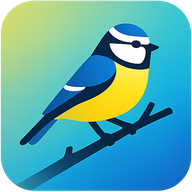
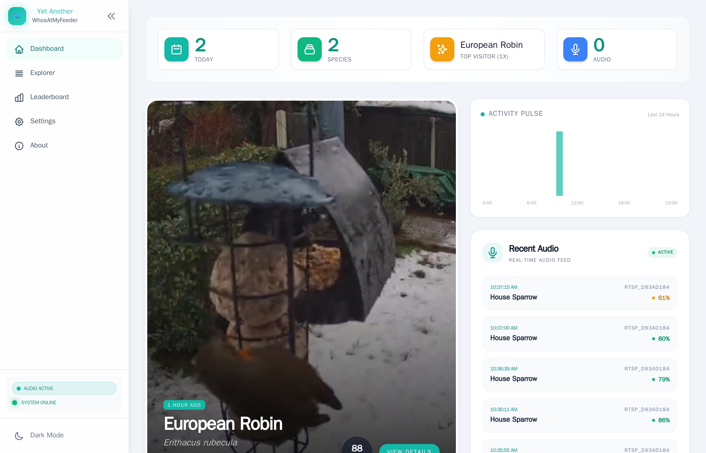

<p align="center">
  
</p>
<h1 align="center">Yet Another WhosAtMyFeeder (YA-WAMF)</h1>
<p align="center"><strong>AI-powered bird feeder classification for Frigate NVR</strong></p>
<p align="center">
  <a href="#documentation">Docs</a> •
  <a href="#quick-start">Quick Start</a> •
  <a href="https://yetanotherwhosatmyfeeder.pownet.uk">Live Demo</a>
</p>
<p align="center">
  <a href="https://github.com/Jellman86/YetAnother-WhosAtMyFeeder" target="_blank" rel="noopener noreferrer">
    
  </a>
</p>
<p align="center"><sub>If YA-WAMF is useful to you, starring the repo helps more people discover it.</sub></p>

A bird classification system that integrates with [Frigate NVR](https://frigate.video/) to automatically identify birds visiting your feeder using advanced AI models.

<p align="center">
  
</p>

<p align="center">
  <sub>If you share your guest dashboard publicly, I would love to see it. Please open an issue or discussion and drop a link so I can take a look.</sub>
</p>

## Features at a Glance

- **Advanced AI Classification** - MobileNetV2, ConvNeXt, or EVA-02 models (up to ~75% top-1 / 88% top-5 across 10,000 species)
- **Hardware Acceleration Selector** - Choose Auto/CPU/NVIDIA CUDA/Intel OpenVINO (single image, runtime fallback)
- **Multi-Sensor Verification** - Correlates visual detections with BirdNET-Go audio
- **Personalized Re-ranking (Optional)** - Learns from manual corrections per camera/model to improve ranking over time
- **Smart Notifications** - Discord, Telegram, Pushover, Email with customizable filters + Notification Center
- **Video Analysis** - Automatic scanning of 15+ frames (temporal ensemble) for improved accuracy
- **High-Quality Event Snapshots** - Optionally replace Frigate's detect-stream snapshot with a later still extracted from the recorded main-stream clip
- **LLM Insights** - AI-powered behavioral analysis (Gemini/OpenAI/Claude)
- **Leaderboard AI Insights** - Analyze detection charts for trends and weather correlations
- **Home Assistant Integration** - Sensors, automation, and dashboard cards
- **BirdWeather Reporting** - Contribute to community science
- **Real-time Dashboard** - Live updates, video playback, species statistics
- **Notification Center** - Pinned progress for long-running jobs and a full notifications view
- **Public View (Guest Mode)** - Share a read-only dashboard with rate limits and optional camera name hiding

## About This Project

A personal project built with AI-assisted coding, inspired by the original [WhosAtMyFeeder](https://github.com/mmcc-xx/WhosAtMyFeeder). When I noticed the original project wasn't being maintained, I saw an opportunity to learn and build something better.

Built with help from AI coding assistants as an experiment in what's possible with modern development tools. Feedback and contributions are welcome!

## Security

Please see the [Security Policy](SECURITY.md) for supported versions, reporting guidelines, and a summary of security features.

## Live Instance

A public instance of YA-WAMF is available here (*always on dev branch, may be broken!*):

- **https://yetanotherwhosatmyfeeder.pownet.uk**

## What It Does

When Frigate detects a bird at your feeder, YA-WAMF:
1. Captures the snapshot and classifies it with local AI (or trusted Frigate sublabels).
2. Optionally correlates with BirdNET-Go audio detections.
3. Stores the detection, pushes notifications, and updates the live UI.
4. Optionally upgrades the cached event image later using a frame from the recorded clip.
5. Optionally performs deeper clip analysis (15+ frames) for better accuracy.
6. Adds optional enrichments like weather, BirdWeather reporting, and AI naturalist insights.

Detailed feature behavior, edge cases, and integration notes are documented in the links below.

## Documentation

Use the full docs hub for setup, integrations, and troubleshooting:
- [📚 Full Documentation Suite](docs/index.md)
- [🚀 Getting Started](docs/setup/getting-started.md)
- [📦 Full Docker Stack Example](docs/setup/docker-stack.md)
- [📷 Recommended Frigate Config](docs/setup/frigate-config.md)
- [🌐 Reverse Proxy Guide](docs/setup/reverse-proxy.md)
- [🔌 API Reference](docs/api.md)
- [🔗 BirdNET-Go Integration](docs/integrations/birdnet-go.md)
- [🏠 Home Assistant Setup](docs/integrations/home-assistant.md)
- [🧠 AI Models & Performance](docs/features/ai-models.md)
- [🛠 Troubleshooting Guide](docs/troubleshooting/diagnostics.md)
- [🧪 Known Issues / Testing Gaps](ISSUES.md)
- [✅ Integration Testing Requests](INTEGRATION_TESTING.md)

## How It Works

Here's the flow from bird to identification:

```
┌─────────────┐     MQTT Event      ┌─────────────┐
│   Frigate   │ ─────────────────>  │  YA-WAMF    │
│   (NVR)     │   "bird detected"   │  Backend    │
└─────────────┘                     └──────┬──────┘
                                           │
                                           v
                                    ┌──────────────┐
                                    │ Fast Path:   │
                                    │ Use Frigate  │
                                    │ Sublabels?   │
                                    └──────┬───────┘
                                           │
                                     (No)  v  (Yes)
                                    ┌──────────────┐
                                    │  AI Engine   │
                                    │ (TFLite/ONNX)│
                                    └──────┬───────┘
                                           │
                                           v
                                    ┌──────────────┐
                                    │ Save to DB & │
                                    │ Notify User  │
                                    └──────┬───────┘
                                           │
                                           v
                                    ┌──────────────┐
                                    │ Auto Video   │
                                    │ Analysis     │
                                    │ (Background) │
                                    └──────────────┘
```

For the full event lifecycle and architecture details, see the documentation links above.

## Quick Start

### Prerequisites

- Docker and Docker Compose installed
- Frigate NVR running with MQTT enabled
- MQTT broker accessible (typically Mosquitto running alongside Frigate)
- Basic knowledge of Docker networking
- For Intel iGPU acceleration (OpenVINO): pass `/dev/dri` into the container and grant the host's actual `/dev/dri` device GIDs (often `video`/`render`, but numeric IDs vary)

### Installation

**1. Download configuration files:**

```bash
mkdir ya-wamf && cd ya-wamf
curl -O https://raw.githubusercontent.com/Jellman86/YetAnother-WhosAtMyFeeder/main/docker-compose.yml
curl -O https://raw.githubusercontent.com/Jellman86/YetAnother-WhosAtMyFeeder/main/.env.example
cp .env.example .env
```

**2. Configure your environment:**

Edit `.env` with your settings:

```env
# Docker network (check with: docker network ls)
DOCKER_NETWORK=frigate

# Frigate instance
FRIGATE_URL=http://frigate:5000

# MQTT broker (usually 'mosquitto' if running in Docker)
MQTT_SERVER=mosquitto
MQTT_PORT=1883

# MQTT authentication (if required)
MQTT_AUTH=true
MQTT_USERNAME=mqtt_user
MQTT_PASSWORD=secret_password

# Timezone
TZ=Europe/London
```

**3. Verify Docker network:**

Ensure the network specified in `.env` exists and matches your Frigate setup:

```bash
docker network ls
```

**Intel iGPU (OpenVINO) note (optional):**

- Add `/dev/dri:/dev/dri` to the backend service
- Add `group_add` entries matching your host's `/dev/dri` numeric group IDs (`ls -ln /dev/dri`)
- YA-WAMF Settings -> Detection now shows OpenVINO diagnostics if the GPU plugin cannot initialize (for example missing OpenCL runtime in older images or container permission issues)

**4. Set permissions, create directories, and start:**

```bash
PUID=$(id -u)
PGID=$(id -g)
echo "PUID=$PUID" >> .env
echo "PGID=$PGID" >> .env
mkdir -p config data/models
sudo chown -R "$PUID:$PGID" config data
sudo chmod -R u+rwX,g+rwX config data
docker compose up -d
```

If you use Portainer stacks, set the same `PUID`/`PGID` values in stack environment variables.

> If you deploy via Portainer: create a Stack from `docker-compose.yml` and use "Pull and redeploy" for updates (after changing image tags or pulling the latest `:latest`/`:dev`).

**5. Access the dashboard:**

Open `http://localhost:9852` (or `http://YOUR_SERVER_IP:9852`)

**6. Download (or re-download) AI models:**

In the web UI, go to **Settings -> Detection -> Model Manager** and download a model. Re-download is also supported with progress tracking and safe staged replace/rollback behavior. Models are saved to `data/models/` and persist across updates.

### Public View (Guest Mode) at a Glance

Guest mode is read-only and rate-limited. Guests can view detections and any existing AI Naturalist analysis, but cannot change settings, delete items, or run new AI analysis. You can hide camera names and limit the public history window in **Settings > Security**.

### Verification

Check logs to confirm everything is working:

```bash
docker compose ps                    # Check container status
docker compose logs yawamf-backend -f  # Follow backend logs

# You should see:
# MQTT config: auth=True port=1883 server=mosquitto
# Connected to MQTT topic=frigate/events
```

### Troubleshooting

| Issue | Solution |
|-------|----------|
| **MQTT connection failed** | Verify `DOCKER_NETWORK` matches Frigate's network<br>Check MQTT hostname and credentials |
| **Frontend not loading** | Run `docker compose ps` to check health<br>View logs: `docker compose logs yawamf-frontend` |
| **No detections** | Confirm Frigate is detecting birds<br>Check backend logs for events<br>Verify model was downloaded in Settings |

For detailed troubleshooting, see the [**Troubleshooting Guide**](docs/troubleshooting/diagnostics.md).

## Frequently Asked Questions

**Q: What model should I use?**
For most users, **RoPE ViT-B14** (the default) is the best balance of accuracy and speed for wildlife-wide classification. If you prefer a larger alternative on standard CPU, try **ConvNeXt Large**. If you have GPU acceleration available and need maximum accuracy on rare or difficult species, try **EVA-02 Large**. For constrained hardware, **MobileNet V2** (legacy) is the fastest option. See [AI Models & Performance](docs/features/ai-models.md) for a full comparison.

**Q: My birds are classified as "Unknown Bird" — how do I fix this?**
Lower the `Min Confidence Floor` (e.g., from 0.4 to 0.2), or lower the `Confidence Threshold` (e.g., from 0.7 to 0.5). Note that wildlife-wide models (ConvNeXt, EVA-02) naturally produce lower per-class scores than birds-only models due to competing against ~8,500 non-bird classes — the recommended threshold shown in the Model Manager card already accounts for this. Enabling Deep Video Analysis also helps for difficult identifications.

**Q: What is "Trust Frigate Sublabels" and should I enable it?**
When enabled, if Frigate has already identified a bird species (via its own classifier or Frigate+), YA-WAMF will trust that label instantly and skip local AI inference. This saves CPU and is useful if you've already tuned Frigate's detection. Disable it to always run YA-WAMF's own AI independently.

**Q: How do I share my dashboard publicly?**
Enable **Guest Mode** in **Settings > Security**. Guests get a read-only view with rate limiting. You can optionally hide camera names and restrict how far back the public history goes. See [Authentication & Access](docs/features/authentication.md).

**Q: What Frigate version is required?**
YA-WAMF works best with **Frigate 0.17+**. The recommended Frigate config in this project uses Frigate 0.17's tiered recording retention format. See the [Frigate Configuration Guide](docs/setup/frigate-config.md).

**Q: Can I run YA-WAMF without Frigate?**
YA-WAMF is designed specifically as a Frigate companion and requires Frigate as its event source. It listens for `frigate/events` MQTT messages and fetches media from the Frigate HTTP API.

**Q: How do I run the model accuracy tests?**
See [Model Accuracy & Benchmarks](docs/features/model-accuracy.md) for full instructions — it covers CPU accuracy benchmarks, Intel GPU validation, and NVIDIA GPU diagnostic probes.

**Q: Why are my clips very short?**
This is expected behaviour for birds. If a bird is only at the feeder for 2 seconds, the Frigate event is 2 seconds. Configure `record.alerts.pre_capture` and `record.detections.pre_capture` in your Frigate config to add context around each detection (e.g., `pre_capture: 5, post_capture: 25`). See the [Frigate Configuration Guide](docs/setup/frigate-config.md).

YA-WAMF also supports an optional `Full visit` clip variant for longer playback from Frigate recordings. When enabled in **Settings → Connection → Frigate**, it requests a configurable camera-level window around the detection timestamp instead of replacing the normal event clip. The default window is `30` seconds before plus `90` seconds after the detection.

**Q: How do I update YA-WAMF?**
Run `docker compose pull && docker compose up -d` from your stack directory. Settings and history are preserved because they live in the persistent `/config` and `/data` volumes.

## Configuration

All settings are managed through the web UI under **Settings**. Configuration is persisted to `config/config.json`.

### Key Settings

| Setting | Description | Default |
|---------|-------------|---------|
| **Frigate URL** | Frigate instance for fetching media | `http://frigate:5000` |
| **MQTT Server** | MQTT broker hostname | `mqtt` |
| **Classification Threshold** | Minimum confidence for detections (0-1) | `0.7` |
| **Min Confidence Floor** | Reject detections below this score | `0.4` |
| **Trust Frigate Sublabels** | Use Frigate's labels instead of local AI | `Enabled` |
| **Auto Video Analysis** | Analyze full video clips for accuracy | `Disabled` |
| **AI Model** | RoPE ViT-B14 (default), ConvNeXt, EVA-02, and birds-only model options in Model Manager | `RoPE ViT-B14` |
| **BirdWeather Token** | Upload detections to BirdWeather | _(none)_ |
| **BirdNET-Go Topic** | MQTT topic for audio detections | `birdnet/text` |

## Security & Authentication

### 🔐 Built-in Authentication
- **Setup Wizard:** On first run, you'll be prompted to set an admin username and password.
- **Guest Mode:** Optionally enable a "Public View" to share your bird detections with friends (read-only) while keeping settings and admin tools secure.
- **Security:** Includes login rate limiting, session management, and security headers.

👉 **[Read the Full Authentication & Access Control Guide](docs/features/authentication.md)**

### 🔑 Legacy API Key (Deprecated)
If you are upgrading from an older version using `YA_WAMF_API_KEY`, your setup will continue to work, but this method is deprecated and will be removed in a future release.

For detailed upgrade instructions, see the [Migration Guide](MIGRATION.md).

## Tech Stack

- **Backend:** Python 3.12, FastAPI, SQLite
- **Frontend:** Svelte 5, Tailwind CSS
- **ML Engine:** ONNX Runtime & TensorFlow Lite
- **Messaging:** MQTT for Frigate events, SSE for live UI updates

## Video Playback & Bandwidth

YA-WAMF includes a robust video proxy that streams clips directly from Frigate. This supports:
- **Instant Playback:** Starts playing immediately without waiting for the whole file.
- **Seeking:** You can jump to any part of the video (scrubbing) thanks to HTTP Range support.
- **Bandwidth Control:** If you are on a metered connection or want to reduce load, you can disable "Fetch Video Clips" in the Settings. This prevents the backend from fetching heavy video files.

## Home Assistant Integration

YA-WAMF includes a custom component for Home Assistant to bring your bird sightings into your smart home.

**Features:**
- **Last Bird Detected Sensor:** Shows the name of the most recent visitor with all metadata (score, camera, weather) as attributes.
- **Daily Count Sensor:** Keeps track of how many birds have visited today.
- **Camera Entity:** (Optional) Proxy for the latest bird snapshot.

**Setup:**
1. Copy the `custom_components/yawamf` folder to your Home Assistant `custom_components` directory.
2. Restart Home Assistant.
3. If the integration icon doesn't appear right away, hard-refresh Home Assistant or clear the browser cache (icons are cached).
4. Add the integration via **Settings > Devices & Services > Add Integration**.
5. Enter your YA-WAMF backend URL (e.g., `http://192.168.1.50:9852`).

## Help Improve YA-WAMF

This project is actively developed and your feedback is valuable!

**How to contribute:**
- **Report bugs** - [Open an issue](https://github.com/Jellman86/YetAnother-WhosAtMyFeeder/issues) for bugs or feature requests
- **Share feedback** - Let me know what works and what doesn't
- **Enable telemetry** - Turn on anonymous usage stats in **Settings > Connections** (see [Telemetry Spec](docs/TELEMETRY_SPEC.md))
- **Test features** - Try video analysis, notifications, and integrations in your environment

## Contributing

Feel free to open PRs if you have improvements to share. Just keep in mind this is a hobby project maintained in spare time.

## License

This project is licensed under the MIT License - see the [LICENSE](LICENSE) file for details.

## Thanks To

- Everyone helping improve the project by reporting bugs, testing fixes, and sharing feedback (see [CONTRIBUTORS.md](CONTRIBUTORS.md))
- The original [WhosAtMyFeeder](https://github.com/mmcc-xx/WhosAtMyFeeder) project for the idea
- [Frigate](https://frigate.video/) for being such a great NVR
- [BirdNET-Go](https://github.com/tbeceele/birdnet-go) for the excellent audio classification integration
- **Ben Jordan** on YouTube for his inspiring [bird detection video](https://youtu.be/hCQCP-5g5bo?si=r__2KjXi6KPGM5FF)
- The AI assistants that helped build this thing
