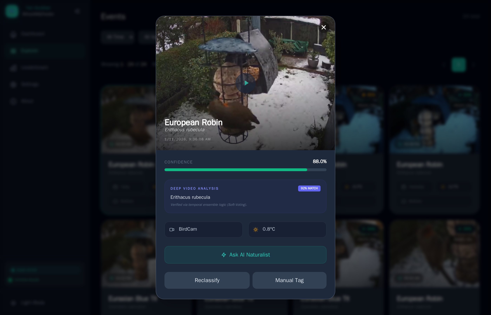

# AI Models & Performance

YA-WAMF supports multiple classifier models, allowing you to balance speed, memory usage, taxonomy scope, and identification accuracy.

## The Model Market
You can manage models directly from the **Settings > Detection > Model Manager** page. The current lineup includes:

- Wildlife-wide ONNX models for broad species coverage
- Birds-only regional and global models for cleaner feeder-focused confidence
- A legacy TFLite fallback for very constrained CPU-only systems
- Separately managed bird-crop detector tiers used by crop-enabled models

> **Platform note:** Raspberry Pi compatibility is currently a best-effort ARM64 target and has not yet been validated on physical Pi hardware in this project environment.

## Inference Providers (CPU / CUDA / Intel OpenVINO)

For ONNX models, YA-WAMF supports a provider selector in **Settings > Detection**:

- `Auto` (recommended): prefers **Intel GPU (OpenVINO)**, then **NVIDIA CUDA**, then CPU.
- `CPU`: ONNX Runtime CPU execution.
- `NVIDIA CUDA`: ONNX Runtime with CUDA (falls back to CPU if CUDA is not actually usable).
- `Intel GPU (OpenVINO)`: OpenVINO GPU plugin (falls back to OpenVINO CPU if the Intel GPU is unavailable).
- `Intel CPU (OpenVINO)`: OpenVINO CPU execution.

### Important behavior (robust fallback)

YA-WAMF intentionally fails soft when acceleration is misconfigured:

- If a provider is selected but unavailable, the backend falls back to a working provider.
- The UI shows:
  - **Selected provider**
  - **Active provider**
  - **Backend** (`onnxruntime` or `openvino`)
  - **Fallback reason**
- CUDA and OpenVINO availability are probed separately from model loading, then validated again during runtime initialization.

### What counts as "available"

- **CUDA available** means:
  - ONNX Runtime CUDA provider is present in the installed wheel, and
  - an NVIDIA CUDA device is actually accessible (not just CUDA-enabled packages installed).
- **OpenVINO available** means:
  - OpenVINO imports successfully, and
  - OpenVINO runtime can initialize.
- **Intel GPU auto-detected** means:
  - OpenVINO enumerated a GPU device (or `GPU.*`) and can expose it to YA-WAMF.

If you only see `OpenVINO: Available` + `Intel GPU: Not detected`, YA-WAMF can still use **OpenVINO CPU**.

### Available Tiers

> **See [Model Accuracy & Benchmarks](model-accuracy.md)** for full benchmark results, GPU support details, and how to run the accuracy tests yourself.

#### Recommended: RoPE ViT-B14 (Default)
- **Format:** ONNX, 375MB
- **Accuracy:** ~70% top-1, 87% top-5 (10,000 species)
- **Speed:** ~474ms on Intel CPU
- **Best for:** General-purpose wildlife identification. This is the configured default model for new installs.

#### Large: ConvNeXt Large
- **Format:** ONNX, 760MB
- **Accuracy:** ~70% top-1, 87% top-5 (10,000 species)
- **Speed:** ~832ms on Intel CPU
- **Best for:** Alternative to RoPE ViT with similar accuracy but higher memory usage.

#### Advanced: EVA-02 Large
- **Format:** ONNX, 1.2GB
- **Accuracy:** ~75% top-1, 88% top-5 (10,000 species)
- **Speed:** ~1.6s on Intel CPU
- **Memory:** Requires ~3GB RAM
- **Best for:** Highest available accuracy — worth the extra cost for rare or difficult species.

#### Birds-Only Families: Small Birds / Medium Birds
- Region-aware family entries that resolve to EU or North America candidate assets based on your configured location.
- Designed for feeder-first setups where a smaller regional label space gives cleaner confidence scores than wildlife-wide models.
- `Small Birds` targets lower RAM and faster inference.
- `Medium Birds` trades more RAM for stronger regional accuracy.

#### Advanced Birds-Only Options
- **FocalNet-B EU Medium:** 707-species European birds-only model with validated CPU, Intel CPU, and Intel GPU support.
- **FlexiViT Global Birds:** compact birds-only model for global or unsupported regions, with CPU and Intel CPU validation.

#### Legacy TFLite (MobileNet V2)
- **Format:** TFLite — runs on CPU-only systems without ONNX Runtime
- **Accuracy:** ~67% top-1, ~73% top-5 (965 species)
- **Speed:** ~13ms
- Hidden by default in the UI. Use only for very constrained hardware.

#### Bird Crop Detector Tiers
- Managed in the same Model Manager as classifier models.
- `Fast` is the default SSD-MobileNet crop detector. It is CPU-friendly and remains the safe fallback path.
- `Accurate` is the experimental YOLOX-Tiny crop detector tier. It is optional, CPU-first, and automatically falls back to `Fast` if the accurate artifact is missing or unhealthy.
- Crop-enabled classifier models require at least one installed crop detector.
- The accurate tier is intended to reduce missed or clipped bird crops in busy feeder scenes, but it should still be treated as experimental until more fixture and real-world benchmarks are published.

## Automatic Video Analysis (Deep Analysis)
In addition to snapshot classification, YA-WAMF can perform **Deep Video Analysis**. This background task scans the full video clip frame-by-frame (temporal ensemble) to verify the identification.

This provides significantly higher confidence by seeing the bird from multiple angles and in motion.

## Fast Path Efficiency
If **"Trust Frigate Sublabels"** is enabled, the system will bypass its own AI classification if Frigate has already identified the species. This saves CPU cycles and is recommended if you have already tuned Frigate's own classification models.

## Behavioral Analysis (LLMs)
For advanced insights, YA-WAMF can send high-confidence snapshots to a Large Language Model (LLM) to generate a "Naturalist Note".

- **Default Provider:** Google Gemini
- **Settings UI recommendation:** `gemini-2.5-flash`
- **Other current presets in the UI:** OpenAI `gpt-5.4` and Claude `claude-sonnet-4-6`

The LLM analyzes the image context (weather, behavior, plumage) and provides a short, educational summary of what the bird is doing. This feature requires an API key.
