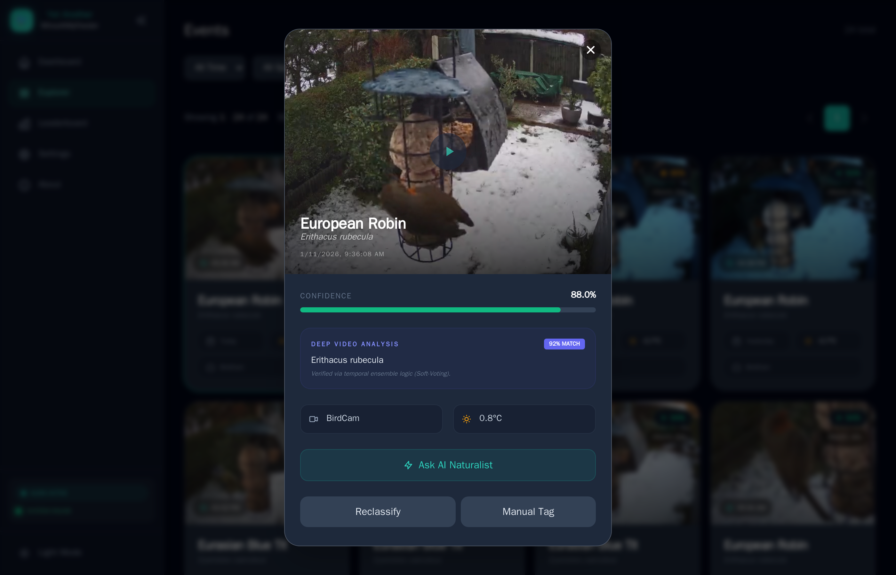

# AI Models & Performance

YA-WAMF supports multiple classifier models, allowing you to balance speed, memory usage, taxonomy scope, and identification accuracy.

## The Model Market
You can manage models directly from **Settings → Detection → Model Manager**. The current lineup includes:

- Wildlife-wide ONNX models for broad species coverage
- Birds-only regional and global models for cleaner feeder-focused confidence
- A legacy TFLite fallback for very constrained CPU-only systems
- Separately managed bird-crop detector tiers for generated thumbnails and automatic localization

> **Platform note:** Raspberry Pi compatibility is currently a best-effort ARM64 target and has not yet been validated on physical Pi hardware in this project environment.

### Validate before you select (post-install gate)

A downloaded model is *installed* (files present) but not yet *validated* (proven to run on your
specific hardware). Setting up a model runs through one guided wizard — the same staged dialog used
by the connection tests — with three stages:

1. **Download** — fetches the model with live progress shown in the dialog (skipped when the model
   is already downloaded).
2. **Run on this hardware** — trial-loads the model and pushes a few frames through it on this host,
   checking it produces finite output (not NaN/garbage on an unsupported accelerator) and reporting
   the per-frame inference latency.
3. **Find fastest device** — sweeps this host's inference devices (CPU / Intel GPU / NPU) with each
   compile isolated in a subprocess, then sets your inference provider to the fastest one that
   passed. Hosts with no accelerator simply stay on CPU/Auto; a busy or unavailable sweep is
   non-fatal and leaves your current setting untouched.
4. **Enable for selection** — makes it active, restoring your previous model if validation fails.

A model that has never been validated on this host shows **Validate to enable** instead of **Use
this model**, and the API rejects activating it (`409`). The model already running and bundled
models are grandfathered, so upgrading never blocks a working install. Validation works on every
host — CPU-only, NVIDIA CUDA, and Intel/OpenVINO — because it exercises the real classifier on
whatever provider your machine resolves. On Intel/OpenVINO hosts the [device compatibility
sweep](model-evaluation.md) also clears the gate.

## Inference Providers (CPU / CUDA / Intel OpenVINO)

For ONNX models, YA-WAMF supports a provider selector under
**Settings → Detection → Inference Provider**:

- `Auto` (recommended): prefers **Intel GPU (OpenVINO)**, then **NVIDIA CUDA**, then CPU.
- `CPU`: ONNX Runtime CPU execution.
- `NVIDIA CUDA`: ONNX Runtime with CUDA (falls back to CPU if CUDA is not actually usable).
- `Intel GPU (OpenVINO)`: OpenVINO GPU plugin (falls back to OpenVINO CPU if the Intel GPU is unavailable).
- `Intel CPU (OpenVINO)`: OpenVINO CPU execution.
- `Intel NPU (OpenVINO)`: OpenVINO NPU execution for a model validated on this host.

The selected image must package the provider: full packages every supported
x86 family, `-cpu` packages ONNX CPU, `-intel` packages ONNX CPU plus OpenVINO,
and `-cuda` packages ONNX Runtime CUDA plus its CPU execution provider. Image
choice never proves the hardware works. See
[Hardware Acceleration](../setup/hardware-acceleration.md) for tags, device
passthrough, and safe switching.

### Important behavior (robust fallback)

YA-WAMF intentionally fails soft when acceleration is misconfigured:

- If a provider is selected but unavailable, the backend falls back to a working provider.
- The UI shows:
  - **Image** and **Packaged** providers
  - **Selected** provider
  - **Active** provider
  - **Backend** (`onnxruntime` or `openvino`)
  - **Fallback** reason or an image/provider mismatch warning
- A provider/image mismatch does not rewrite the saved selection. The current
  image uses CPU fallback and the original selection becomes usable again after
  switching back to a compatible image.
- CUDA and OpenVINO availability are probed separately from model loading, then validated again during runtime initialization.

### What counts as "available"

- **CUDA available** means:
  - ONNX Runtime CUDA provider is present in the installed wheel, and
  - an NVIDIA CUDA device is actually accessible (not just CUDA-enabled packages installed).
- **OpenVINO available** means:
  - OpenVINO imports successfully, and
  - OpenVINO runtime can initialize.
- **Intel GPU auto-detected** means:
  - OpenVINO enumerated a GPU device (or `GPU.*`) and can expose it to YA-WAMF.
- **Intel NPU auto-detected** means:
  - OpenVINO enumerated an NPU device and the selected model still has to pass
    its per-host compatibility validation.

If you only see `OpenVINO: Available` + `Intel GPU: Not detected`, YA-WAMF can still use **OpenVINO CPU**.

### Available Tiers

> **See [Model Accuracy & Benchmarks](model-accuracy.md)** for full benchmark results, GPU support details, and how to run the accuracy tests yourself.

#### Recommended: RoPE ViT-B14 (Default)
- **Format:** ONNX, 375MB
- **Accuracy:** ~70% top-1, 87% top-5 (10,000 species)
- **Speed:** ~312ms on the validated Arrow Lake Intel GPU; performance varies by host
- **Acceleration:** Intel GPU and NPU validated on Arrow Lake with OpenVINO 2026.2.1; older Intel
  combinations must pass the built-in per-host validation before use
- **Best for:** General-purpose wildlife identification. This is the configured default model for new installs.

#### Large: ConvNeXt Large
- **Format:** ONNX, 760MB
- **Accuracy:** ~70% top-1, 87% top-5 (10,000 species)
- **Speed:** ~832ms on Intel CPU
- **Best for:** Alternative to RoPE ViT with similar accuracy but higher memory usage.

#### Advanced: EVA-02 Large
- **Format:** ONNX, 1.2GB
- **Accuracy:** ~75% top-1, 88% top-5 (10,000 species)
- **Speed:** ~1.6s on Intel CPU
- **Memory:** Requires ~3GB RAM
- **Best for:** Highest available accuracy — worth the extra cost for rare or difficult species.

#### Birds-Only Families: Small Birds / Medium Birds
- Region-aware family entries that resolve to EU or North America candidate assets based on your configured location.
- Designed for feeder-first setups where a smaller regional label space gives cleaner confidence scores than wildlife-wide models.
- `Small Birds` targets lower RAM and faster inference.
- `Medium Birds` trades more RAM for stronger regional accuracy.

#### Advanced Birds-Only Options
- **FocalNet-B EU Medium:** 707-species European birds-only model with validated CPU, Intel CPU,
  Intel GPU, and Intel NPU support.
- **FlexiViT Global Birds:** compact birds-only model for global or unsupported regions, with CPU,
  Intel CPU, and Intel NPU validation.

#### Legacy TFLite (MobileNet V2)
- **Format:** TFLite — runs on CPU-only systems without ONNX Runtime
- **Accuracy:** ~67% top-1, ~73% top-5 (965 species)
- **Speed:** ~13ms
- Hidden by default in the UI. Use only for very constrained hardware.

#### Bird Crop Detector Tiers
- Managed in the same Model Manager as classifier models.
- Shown separately as **Cropped thumbnails**, not as a classifier model option. Crop generation and
  classifier crop-on/off policy are both automatic.
- `Fast` is the default SSD-MobileNet crop detector. It is CPU-friendly and remains the safe fallback path.
- `Accurate` is the experimental YOLOX-Tiny crop detector tier. It is optional, CPU-first, and
  automatically retries with `Fast` when the artifact is unavailable or when accurate inference
  cannot produce a usable crop (including no candidate, low confidence, an undersized/invalid box,
  or inference failure).
- Generated crops try `Accurate` first and `Fast` second. Crop-enabled classifier models use the same
  detector fallback while retaining their separately validated crop-on/off policy. The legacy tier
  setting remains API-compatible but no longer lowers the automatic quality path.
- The accurate tier is intended to reduce missed or clipped bird crops in busy feeder scenes, but it should still be treated as experimental until more fixture and real-world benchmarks are published.

#### Best-available event snapshots

**Settings → Data → Snapshot quality → Best available event snapshots** is an automatic outcome,
not a source selector. When enabled, YA-WAMF samples up to three promising main-stream clip frames,
builds a full-frame candidate plus every valid Frigate-hint and detector crop, and reclassifies the
candidates. The full high-quality frame competes with valid, identity-consistent crops and remains
canonical when it is the clearest trustworthy image. The old `bird_crop_source_priority` and
`media_cache_high_quality_event_snapshot_bird_crop` fields remain readable/writable for API and
configuration compatibility, but do not override this policy.

Each candidate still goes through the active classifier's declared preprocessing: input size,
resize mode, interpolation, colour space, normalisation, mean and standard deviation. A generated
bird crop is marked as already cropped, which prevents a model's optional localisation policy from
cropping it a second time; it does not bypass the model's normal resize and tensor preparation.

YA-WAMF can also use the crop classifications to refine the detection. It requires the same species
to clear both the active model's recommended confidence and a conservative 0.60 floor on at least
two different clip frames. Multiple crop sources from one frame count as one vote. A close competing
multi-frame result blocks promotion. Automatic refinement can upgrade **Unknown Bird** or improve a
lower-scoring result for the same canonical species, but it never replaces a manual tag or a
conflicting known species.

The pipeline is fail-soft: the accurate detector retries through the fast detector, a detector miss
can still use Frigate's tracked-object box, and total crop failure keeps the clear full frame. Recent
events without generated candidates are reconciled after restart so an in-memory queue loss does not
permanently strand their upgrade. Retry state survives restarts, backs off for five, fifteen, and
forty-five minutes, and becomes terminal after a fourth failure; an explicit regeneration with newly
available media can still succeed. `/health` exposes `high_quality_snapshots.crop_policy`, selected
source counts, snapshot outcomes, classification-refinement outcomes, and the recovered-job total
for operational verification.

## Automatic Video Analysis (Deep Analysis)
In addition to snapshot classification, YA-WAMF can perform **Deep Video Analysis**. This background task scans the full video clip frame-by-frame (temporal ensemble) to verify the identification.

This provides significantly higher confidence by seeing the bird from multiple angles and in motion.

## Frigate sublabel fallback

If **Trust Frigate sublabels** is enabled, YA-WAMF still runs the selected local model first. The
Frigate label is a fallback when media is unavailable, local inference produces no usable result, or
the local prediction does not clear policy. Frigate's sublabel confidence is kept separate from its
bird-object detector score, and YA-WAMF does not echo a fallback label straight back to Frigate.

Deep video uses temporal consensus rather than a single maximum frame: at least three frames are
evaluated, low-confidence/non-species frames count as abstentions, and the winner needs two
supporting frames plus 60% of all evaluated frames. Its confidence is the median of its supporting
frames.

## Behavioral Analysis (LLMs)
For advanced insights, YA-WAMF can send high-confidence snapshots to a Large Language Model (LLM) to generate a "Naturalist Note".

- **Default Provider:** Google Gemini
- **Settings UI recommendation:** `gemini-3.1-flash-lite`
- **Other current presets in the UI:** OpenAI `gpt-5.6`, Claude `claude-opus-4-8`, and OpenRouter `google/gemini-3.1-flash-lite`
- **OpenRouter behavior:** the UI shows a few presets, but accepts any non-empty OpenRouter model ID.

The LLM analyzes the image context (weather, behavior, plumage) and provides a short, educational summary of what the bird is doing. This feature requires an API key.

Use **Settings → AI → Test AI Connection** before analyzing detections. The diagnostic opens a
multi-stage result panel covering configuration, provider availability, vision support,
multi-frame admission, and response generation. It sends five generated 1280×720 JPEG frames,
matching the count, dimensions, media format, and approximate payload size of the default detection
analysis without requiring a live event. A successful diagnostic therefore proves that the model
accepts a representative production request, but it is not a provider load benchmark. Rate limits
and temporary provider unavailability remain retryable; when the provider supplies `Retry-After`,
the panel shows it.
