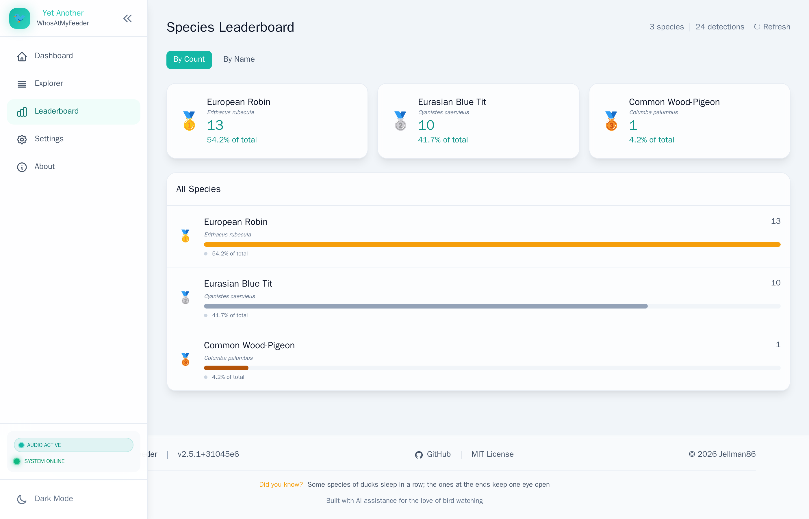

# Taxonomy & Naming

YA-WAMF uses a professional taxonomy engine to ensure every bird sighting is recorded with both its common and scientific identity.

## iNaturalist Integration
The system is connected to the [iNaturalist API](https://www.inaturalist.org/). Every time a new species is detected, YA-WAMF:
1. Performs a bidirectional lookup (Common ↔ Scientific).
2. Retrieves the standard Taxonomic ID.
3. Caches the result in a local SQLite table (`taxonomy_cache`) to avoid redundant API calls.

## Display Modes
You can customize how birds are named in the UI via **Settings > Detection**:

- **Standard:** Common name is primary, Scientific name is the subtitle.
- **Hobbyist:** Scientific name is primary, Common name is the subtitle.
- **Strictly Scientific:** Only the Scientific name is shown.

## Taxonomy Repair
If your database has old detections with inconsistent naming, you can run the **Taxonomy Repair** tool in the settings. This tool will scan your entire history and normalize all labels against the iNaturalist database.

## Where names come from

Names are resolved in order, and the first source that answers wins:

1. **Your own name for a species**, if you have set one. Nothing overrides it.
2. **iNaturalist**, which also supplies the taxon id used for enrichment.
3. **The bundled species reference**, when the network cannot answer. It carries 11,276 species
   from the IOC World Bird List with names in every language this project presents, so an offline
   or air-gapped install still names birds, in your language, with no API key.
4. **eBird**, for species the bundled list does not carry, when you have configured a key.

The bundled reference is generated from the IOC World Bird List and redistributed under
[CC BY 3.0](https://creativecommons.org/licenses/by/3.0/); see
`backend/app/assets/species_reference.NOTICE.md` for the attribution.
