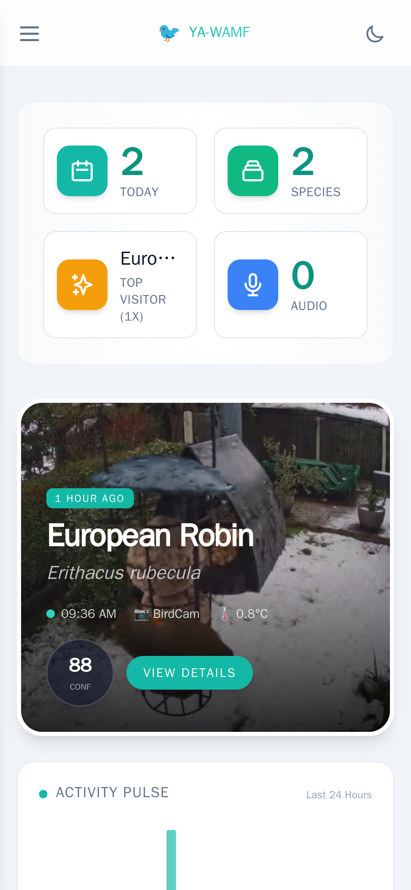

# YA-WAMF Documentation

Welcome to the documentation for **Yet Another WhosAtMyFeeder (YA-WAMF)**. This guide covers everything from basic setup to advanced AI tuning.

> 🦜 **New to YA-WAMF?** Start with the [Getting Started](setup/getting-started.md) guide to have your feeder online in minutes.
> 🔓 **Sharing your dashboard?** See [Authentication & Access](features/authentication.md) for guest mode, rate limits, and privacy controls.

---

## 🚀 Setup & Installation
Everything you need to get the containers running and configured correctly.
- **[🚀 Getting Started](setup/getting-started.md)** - Fast-track installation using Docker Compose.
- **[📦 Full Docker Stack](setup/docker-stack.md)** - A complete example including Frigate and MQTT.
- **[📷 Recommended Frigate Config](setup/frigate-config.md)** - Optimized settings for bird snapshots.
- **[🌐 Reverse Proxy Guide](setup/reverse-proxy.md)** - Configs for Cloudflare Tunnel, Nginx, Caddy.
- **[⚙️ Configuration Guide](setup/configuration.md)** - Deep dive into all web UI settings.

## 🔌 API & Development
Build integrations and custom tools with YA-WAMF.
- **[🔌 API Reference](api.md)** - Complete REST API documentation with examples
- **OpenAPI/Swagger** - Interactive API docs when running:
  - Docker Compose default: `http://localhost:8946/docs`
  - Local backend (`uvicorn ... --port 8000`): `http://localhost:8000/docs`

### Mobile Ready
YA-WAMF is fully responsive and works great on phones and tablets.

  

## 🔗 Integrations
Connect YA-WAMF to the rest of your smart home and community projects.
- **[📹 Frigate NVR](integrations/frigate.md)** - Connecting to your camera system.
- **[🎵 BirdNET-Go](integrations/birdnet-go.md)** - Multi-sensor audio correlation.
- **[🌦️ BirdWeather](integrations/birdweather.md)** - Uploading to community science stations.
- **[🌿 iNaturalist](integrations/inaturalist.md)** - Owner-reviewed submissions to iNaturalist.
- **[🏠 Home Assistant](integrations/home-assistant.md)** - Sensors, cards, and automations.

## Feature Deep Dives

- [🔐 Authentication & Access](features/authentication.md) - Admin passwords, guest mode, and security
- [🛡️ Security Policy](../SECURITY.md) - Supported versions, reporting, and security overview
- [🧠 AI Models & Performance](features/ai-models.md) - Understanding MobileNet vs ConvNeXt vs EVA-02
- [🗂 Taxonomy & Naming](features/taxonomy.md) - How scientific naming works
- [🔔 Notifications](features/notifications.md) - Discord, Pushover, Telegram, Email + Notification Center
- [📊 Telemetry](features/telemetry.md) - Transparency on anonymous usage metrics

## Troubleshooting
Solving common issues and using diagnostic tools.
- **[🛠 Diagnostics & Logs](troubleshooting/diagnostics.md)** - Using MQTT tests and Backfill reports.
