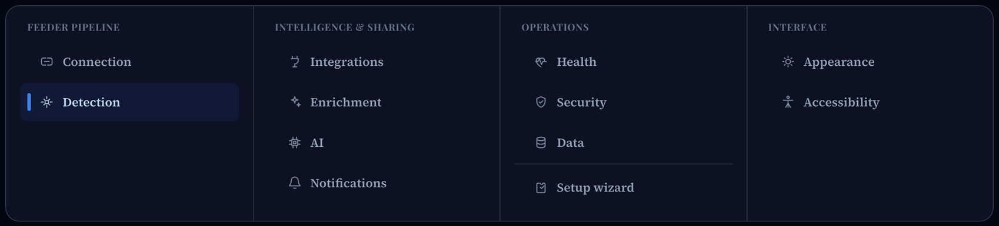

# YA-WAMF Documentation

Welcome to the documentation for **Yet Another WhosAtMyFeeder (YA-WAMF)**. This guide covers everything from basic setup to advanced AI tuning.

> 🦜 **New to YA-WAMF?** Start with the [Getting Started](setup/getting-started.md) guide to have your feeder online in minutes.
> 🔓 **Sharing your dashboard?** See [Authentication & Access](features/authentication.md) for public access, rate limits, and what a guest can see.

---

## 🚀 Setup & Installation
Everything you need to get the containers running and configured correctly.
- **[🚀 Getting Started](setup/getting-started.md)** - Fast-track installation using Docker Compose.
- **[🍓 Raspberry Pi Setup](setup/raspberry-pi.md)** - ARM64 monolith install notes, image override, and expected limitations.
- **[🧡 Unraid Setup](setup/unraid.md)** - One-template install using the Docker template, with paths, ports, and optional hardware acceleration.
- **[📦 Full Docker Stack](setup/docker-stack.md)** - A complete example including Frigate and MQTT.
- **[🔄 Split-to-Monolith Migration](setup/migrate-split-to-monolith.md)** - Transition guidance for existing two-container installs.
- **[📷 Recommended Frigate Config](setup/frigate-config.md)** - Optimized settings for bird snapshots.
- **[🔌 MQTT Broker Setup](setup/mqtt-broker.md)** - Running Mosquitto alongside Frigate and connecting all three containers.
- **[🌐 Reverse Proxy Guide](setup/reverse-proxy.md)** - Configs for Cloudflare Tunnel, Nginx, Caddy.
- **[⚙️ Configuration Guide](setup/configuration.md)** - Deep dive into all web UI settings.
- **[🌱 Environment Variables](setup/environment-variables.md)** - Complete reference for every env override, with defaults.
- **[⚡ Hardware Acceleration](setup/hardware-acceleration.md)** - Choose the full, CPU, Intel, or CUDA image; configure device passthrough; and verify packaged, available, and active providers.

## 🖥 The interface, screen by screen

The sidebar splits into **Observe** (what the feeder saw) and **Manage** (how it behaves).

| Screen | What it is for | Read next |
|---|---|---|
| **Dashboard** | Today at a glance: a field log of visits, anything waiting on your call, camera and audio totals, weather, and a 24-hour activity histogram. | [Getting Started](setup/getting-started.md) |
| **Explorer** | Every classified visit, as cards or a compact list, filtered by time window, species, camera, favourites, and audio matches. | [Getting Started](setup/getting-started.md) |
| **Add observation** | Classify a photo or clip you took yourself and file it in the same history. Owner only. | [Manual Observations](features/manual-observations.md) |
| **Leaderboard** | Who visits most, over a day, week, month, or all time, with seen/heard/both breakdowns and audio history. | [Taxonomy & Naming](features/taxonomy.md) |
| **Notifications** | Alerts and background jobs on one surface, filtered by Birds, Updates, Jobs, or Errors. | [Notifications](features/notifications.md) |
| **Settings** | Twelve sections grouped as Feeder pipeline, Intelligence & sharing, Operations, and Interface. | [Configuration Guide](setup/configuration.md) |

  

### Mobile Ready
The layout adapts to phones and tablets, with the dashboard counts above the field log.

  

## 🔌 API & Development
Build integrations and custom tools with YA-WAMF.
- **[🔌 API Reference](api.md)** - Complete REST API documentation with examples
- **OpenAPI/Swagger** - Interactive API docs. Accessible at `http://localhost:8000/docs` when running the backend directly. In the monolithic container the FastAPI process is internal — see the [API Reference](api.md) for access options. In the legacy split deployment the backend is exposed at `http://localhost:8946/docs`.

## 🔗 Integrations
Connect YA-WAMF to the rest of your smart home and community projects.
- **[📹 Frigate NVR](integrations/frigate.md)** - Connecting to your camera system.
- **[🎵 BirdNET-Go](integrations/birdnet-go.md)** - Multi-sensor audio correlation.
- **[🌦️ BirdWeather](integrations/birdweather.md)** - Uploading to community science stations.
- **[🦉 eBird](integrations/ebird.md)** - Nearby sightings, notable reports, and CSV export.
- **[🌿 iNaturalist](integrations/inaturalist.md)** - Owner-reviewed submissions to iNaturalist.
- **[🏠 Home Assistant](integrations/home-assistant.md)** - Sensors, cards, and automations.

## Feature Deep Dives

- [🔐 Authentication & Access](features/authentication.md) - Owner password, public access, and what a guest can see
- [🛡️ Security Policy](../SECURITY.md) - Supported versions, reporting, and security overview
- [🧠 AI Models & Performance](features/ai-models.md) - Understanding the model tiers, plus CPU/CUDA/OpenVINO provider behavior
- [📊 Model Accuracy & Benchmarks](features/model-accuracy.md) - Benchmark results, GPU support matrix, and how to run accuracy tests
- [🧪 Model Evaluation](features/model-evaluation.md) - Compare installed models against labelled feeder images
- [🎞 Deep Video Analysis](features/video-analysis.md) - Multi-frame clip analysis, sampling behavior, and UI feedback
- [📤 Manual Observations](features/manual-observations.md) - Classify an uploaded photo or video, review the evidence, and add it to history
- [🗂 Taxonomy & Naming](features/taxonomy.md) - Where a bird's name comes from, and the species catalogue behind it
- [🔔 Notifications](features/notifications.md) - Discord, Pushover, Telegram, and Email, plus filters and the Notifications surface
- [⭐ Favourites](features/favourites.md) - What the star keeps, where the archive lives, and the per-species floor
- [📊 Telemetry](features/telemetry.md) - Transparency on anonymous usage metrics

## Troubleshooting
Solving common issues and using diagnostic tools.
- **[🛠 Diagnostics & Logs](troubleshooting/diagnostics.md)** - Using MQTT tests and Backfill reports.
- **[📼 Frigate Event Not Found](troubleshooting/frigate-event-not-found.md)** - Diagnose short-lived events and missing upstream media.
- **[🐌 Slow Interface, or a Page That Never Loads](troubleshooting/slow-interface.md)** - Reading the connection pool in a diagnostics bundle when the UI stalls.
- **[🍎 Video Will Not Play in Safari](troubleshooting/safari-video-playback.md)** - Why a clip that opens in QuickTime can still be refused by Safari, and how to check the packaging.

## Engineering & Quality
How the project is built and held to standard.
- **[📐 Engineering Standards](../CLAUDE.md)** - The contract every change must clear: safety, testing, database, UI, and Definition of Done.
- **[📝 Documentation Standard](documentation-standard.md)** - Audience, Diátaxis structure, safety-claim rules, and screenshot rules every user-facing page follows.
- **[🧑‍💻 Code-Quality Standard](standards/code-quality.md)** - The researched code-craft bar for Python/FastAPI + Svelte 5/TypeScript, with authoritative sources.
- **[🎨 UI/UX Standard](standards/ui-ux.md)** - Usability (Nielsen's heuristics), accessibility (WCAG 2.2 AA), and visual craft (Refactoring UI).
- **[📣 Writing a Release](development/releasing.md)** - The human-first GitHub Release standard, template, and checklist.
- **[🎁 YA-WAMF 2.19.7 Release Notes](releases/v2.19.7.md)** - A restarted video worker no longer costs you the visit: the job waits for the new worker, or is queued again.
- **[YA-WAMF 2.19.6 Release Notes](releases/v2.19.6.md)** - Release images that say they are releases, and a footer link that opens the changelog for the build you are running.
- **[YA-WAMF 2.19.5 Release Notes](releases/v2.19.5.md)** - The refresh message that would not go away, background jobs that say when they stopped, and a backfill counted once.
- **[YA-WAMF 2.19.4 Release Notes](releases/v2.19.4.md)** - Notifications that open the detection, a feeder that keeps classifying when a model is slow to start, and a session token that stays out of proxy logs.
- **[YA-WAMF 2.19.0 Release Notes](releases/v2.19.0.md)** - Per-medium sharing controls for visitors, a review queue that catches implausible first sightings, and weather from your own Home Assistant.
- **[Every release](releases/)** - The full set of human-first release notes, newest last.
- **[🏅 Gold-Standard Review (2026-07-07)](reviews/2026-07-07-project-quality-and-gold-standard-review.md)** - Honest assessment against the standards and the path to close remaining gaps.
- **[🌍 Translation Editorial Review (2026-07-20)](reviews/2026-07-20-translation-editorial-review.md)** - Locale coverage, editorial findings, permanent regression gates, and the native-review limitation.
- **[🍓 Raspberry Pi Assessment (2026-07-21)](reviews/2026-07-21-raspberry-pi-assessment.md)** - What the ARM64 image and QEMU inference gate prove, plus the physical-hardware exit criteria.
- **[🗂️ Species Catalogue Phase 0 Inventory (2026-08-19)](reviews/2026-08-19-species-catalogue-phase0-inventory.md)** - The pinned species-data sources, every supported model artifact with its declared label grammar, and measured name resolution.
- **[🍄 Non-bird Classes vs Catalogue of Life (2026-08-20)](reviews/2026-08-20-col-nonbird-mapping-report.md)** - How the 8,514 non-bird model classes resolve against the pinned COL26.7 release, with every unresolved class listed rather than guessed.
- **[🗺️ Roadmap](../ROADMAP.md)** - The single forward-looking plan: the Road to 3.0, the prioritised open backlog, and the delivered-features catalogue.
