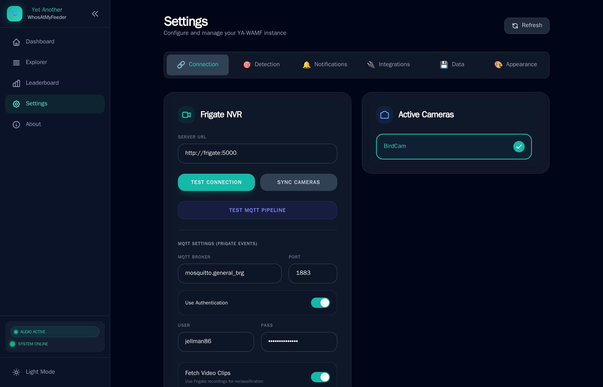

# Configuration

Most settings in YA-WAMF can be managed directly through the web UI. These settings are stored in `/config/config.json`.

## Connection Settings
Settings for communicating with your NVR and messaging broker.

| Setting | Description |
|---------|-------------|
| **Server URL** | The URL of your Frigate instance. Used to fetch snapshots and video clips. |
| **MQTT Broker** | The hostname of your MQTT broker. |
| **Port** | MQTT port (default 1883). |
| **Authentication** | Toggle if your broker requires a username and password. |
| **Active Cameras** | Select which Frigate cameras YA-WAMF should monitor for bird events. |

## Detection Settings
Fine-tune how AI identifications are handled. This is the most important section for balancing accuracy and noise.

| Setting | Description |
|---------|-------------|
| **Confidence Threshold** | The "Species Gatekeeper". If the AI score is higher than this (e.g., 0.7), the bird is saved with its specific species name. |
| **Min Confidence Floor** | The "Existence Gatekeeper". Anything below this score (e.g., 0.2) is discarded as a false positive (shadows, bugs, etc.). |
| **Trust Frigate Sublabels** | The "Fast Path". If enabled and Frigate provides an identification, YA-WAMF trusts it instantly, bypassing both the local AI and the Confidence Floor. |

### 🛠 How Thresholds Work Together
The logic follows a three-tier system:

1.  **High Confidence (Score > Threshold):**
    *   *Result:* Saved as the detected species (e.g., "Northern Cardinal").
    *   *Action:* Reported to BirdWeather and Home Assistant.
2.  **Medium Confidence (Floor < Score < Threshold):**
    *   *Result:* Saved as **"Unknown Bird"**.
    *   *Why?* The system is sure there is a bird, but not sure enough to bet on the species. This keeps your stats clean while still recording the visit.
3.  **Low Confidence (Score < Floor):**
    *   *Result:* **Discarded**.
    *   *Why?* Likely a false positive or an extremely blurry image that isn't useful.

### 💡 Pro-Tip: The "Bypass"
If you have **"Trust Frigate Sublabels"** enabled, and Frigate identifies a "Blue Jay", YA-WAMF will save it as a "Blue Jay" even if its own local model only got a 0.1 score. This is useful because Frigate has access to the full motion stream, whereas YA-WAMF's real-time pass only sees a single snapshot.

## Integration Settings
Configure third-party services.

- **BirdNET-Go:** Configure the MQTT topic and map Frigate cameras to audio sensor IDs.
- **BirdWeather:** Enter your Station Token to contribute detections to the BirdWeather community.
- **iNaturalist:** Owner-reviewed submissions via OAuth. Requires App Owner approval (currently untested).
- **AI Insights:** Connect Google Gemini (default: `gemini-3-flash-preview`), OpenAI, or Claude to get behavioral analysis of your visitors.

## Notification Settings
Configure how and where alerts are sent.

- **Discord / Pushover / Telegram:** Provide platform tokens and enable snapshots.
- **Email (OAuth/SMTP):** Use Gmail/Outlook OAuth or traditional SMTP with optional auth.
- **Filters:** Minimum confidence, audio-confirmed only, and species whitelist.
- **Language:** Choose the language used in notifications.

## Accessibility & Language
Customize the UI experience for comfort and assistive technologies.

- **High Contrast / Dyslexia Font / Reduced Motion:** Adjust UI readability.
- **Live Announcements:** Toggle screen reader announcements for new detections.
- **UI Language:** Set the interface language (also used for notifications).

## Security & Access
Configure authentication and public access controls.

- **Authentication:** Enable login, set username/password, and configure session expiry.
- **Trusted Proxy Hosts:** If you run behind a reverse proxy, list its IPs, CIDR ranges, or container/DNS names so client IPs are trusted correctly.
- **Public Access:** Enable a guest view and set rate limits plus whether camera names are visible.

### Recommended Reverse Proxy Routing

For the cleanest HTTPS detection, route API traffic directly to the backend:

- `/` → `yawamf-frontend:80`
- `/api/*` → `yawamf-backend:8000`

This avoids a multi-hop proxy chain and prevents HTTPS warnings caused by intermediate proxies.

## Data Management
- **Retention Policy:** Choose how long to keep sightings in your history.
- **Media Cache:** Toggle local caching of snapshots and video clips to reduce load on Frigate and speed up the UI.
- **Taxonomy Repair:** Manually trigger a sync to normalize all species names using iNaturalist data.
