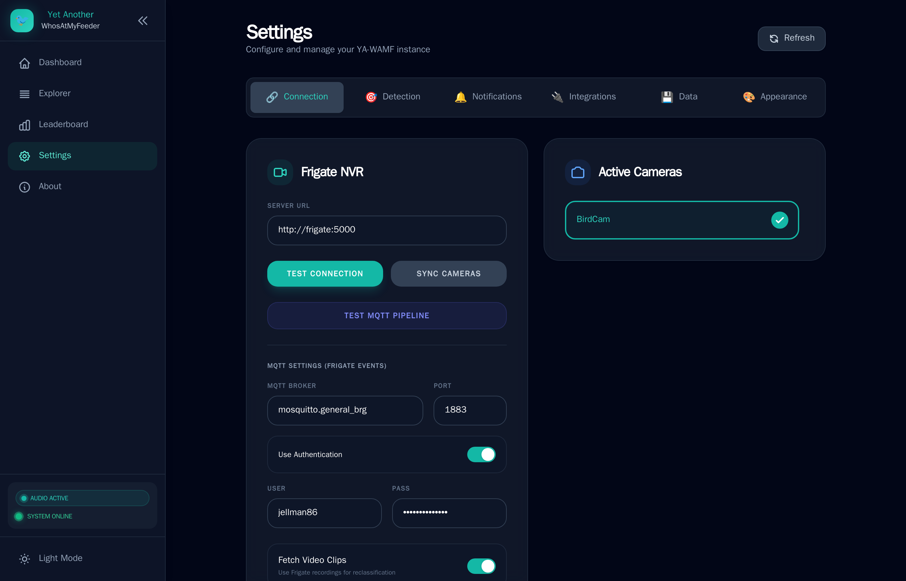

# Configuration

Most settings in YA-WAMF can be managed directly through the web UI. These settings are stored in `/config/config.json`.

## Connection Settings
Settings for communicating with your NVR and messaging broker.

| Setting | Description |
|---------|-------------|
| **Server URL** | The URL of your Frigate instance. Used to fetch snapshots and video clips. |
| **MQTT Broker** | The hostname of your MQTT broker. |
| **Port** | MQTT port (default 1883). |
| **Authentication** | Toggle if your broker requires a username and password. |
| **Active Cameras** | Select which Frigate cameras YA-WAMF should monitor for bird events. Hover the play icon to preview a live snapshot (via the Frigate proxy). |

## Detection Settings
Fine-tune how AI identifications are handled. This is the most important section for balancing accuracy and noise.

| Setting | Description |
|---------|-------------|
| **Confidence Threshold** | The "Species Gatekeeper". If the AI score is higher than this (e.g., 0.7), the bird is saved with its specific species name. |
| **Min Confidence Floor** | The "Existence Gatekeeper". Anything below this score (e.g., 0.2) is discarded as a false positive (shadows, bugs, etc.). |
| **Trust Frigate Sublabels** | The "Fast Path". If enabled and Frigate provides an identification, YA-WAMF trusts it instantly, bypassing both the local AI and the Confidence Floor. |
| **Write Frigate Sublabel** | Controls whether YA-WAMF pushes its own species identification back to Frigate as a sublabel. Disable if you do not want YA-WAMF writing back to Frigate events. |
| **Bird Model Region** | Override automatic regional model selection (`Auto`, `Europe`, `North America`) for birds-only model families. |
| **Execution Mode** | `In-Process` (default, lower RAM — shares one model instance) or `Subprocess` (isolated workers with independent restart/circuit-breaker logic). |
| **Personalized Re-ranking** | Optional learning layer that uses your manual species corrections to re-rank future predictions for the same camera and active model. Activates after at least 20 manual tags for that camera/model pair. |

### 🛠 How Thresholds Work Together
The logic follows a three-tier system:

1.  **High Confidence (Score > Threshold):**
    *   *Result:* Saved as the detected species (e.g., "Northern Cardinal").
    *   *Action:* Reported to BirdWeather and Home Assistant.
2.  **Medium Confidence (Floor < Score < Threshold):**
    *   *Result:* Saved as **"Unknown Bird"**.
    *   *Why?* The system is sure there is a bird, but not sure enough to bet on the species. This keeps your stats clean while still recording the visit.
3.  **Low Confidence (Score < Floor):**
    *   *Result:* **Discarded**.
    *   *Why?* Likely a false positive or an extremely blurry image that isn't useful.

### 💡 Pro-Tip: The "Bypass"
If you have **"Trust Frigate Sublabels"** enabled, and Frigate identifies a "Blue Jay", YA-WAMF will save it as a "Blue Jay" even if its own local model only got a 0.1 score. This is useful because Frigate has access to the full motion stream, whereas YA-WAMF's real-time pass only sees a single snapshot.

### 🎯 Personalized Re-ranking Details
- Scope: Feedback is isolated by **camera + active model ID**. Corrections from one camera/model do not affect others.
- Activation threshold: Re-ranking remains inactive until there are at least **20** manual correction tags for that camera/model pair.
- Time decay: Newer corrections are weighted more heavily than older ones, so stale patterns fade over time.
- Safety: Score adjustments are bounded and fail-open; if feedback is unavailable or lookup fails, YA-WAMF uses the base classifier scores.

## Integration Settings
Configure third-party services.

- **BirdNET-Go:** Configure the MQTT topic and map Frigate cameras to audio sensor IDs. Multiple source names per camera are supported (comma-separated).
- **BirdWeather:** Enter your Station Token to contribute detections to the BirdWeather community.
- **iNaturalist:** Owner-reviewed submissions via OAuth. Requires App Owner approval (currently untested).
- **AI Insights:** Connect Google Gemini, OpenAI, or Claude to get behavioral analysis of your visitors. The Settings UI surfaces current recommended models per provider.
- **Location:** Set your latitude/longitude for weather enrichment. Also configure **Weather Units** (`Metric`, `Imperial`, or `British` for °C + mph + mm) and optional `state`/`country` values for eBird export.
- **eBird Export:** Download detections as a standard eBird CSV record file from **Settings > Data**. Supports full export or a filtered date range. `Unknown Bird` entries are excluded. Requires English species names in the taxonomy cache.

## Notification Settings
Configure how and where alerts are sent.

- **Discord / Pushover / Telegram:** Provide platform tokens and enable snapshots.
- **Email (OAuth/SMTP):** Use Gmail/Outlook OAuth or traditional SMTP with optional auth.
- **Mode:** Choose Final-only, Standard, Realtime, or Silent delivery (Advanced allows custom triggers).
- **Filters:** Minimum confidence, audio-confirmed only, and species whitelist.
- **Language:** Choose the language used in notifications.

## Accessibility & Language
Customize the UI experience for comfort and assistive technologies.

- **High Contrast / Dyslexia Font / Reduced Motion:** Adjust UI readability.
- **Live Announcements:** Toggle screen reader announcements for new detections.
- **UI Language:** Set the interface language (also used for notifications).

## Debug UI
Optional debug tools for testing and diagnostics.

- Enable via env: `SYSTEM__DEBUG_UI_ENABLED=true`
- Or in config: `"system": { "debug_ui_enabled": true }`
- Or via compose: `DEBUG_UI_ENABLED=true`

This reveals a **Debug** tab in Settings (e.g., iNaturalist preview toggle).

## Security & Access
Configure authentication and public access controls.

- **Authentication:** Enable login, set username/password, and configure session expiry.
- **Trusted Proxy Hosts:** If you run behind a reverse proxy, list its IPs, CIDR ranges, or container/DNS names so client IPs are trusted correctly.
- **Public Access:** Enable a guest view and set rate limits plus whether camera names are visible.

### Recommended Reverse Proxy Routing

For the monolithic deployment (recommended), route all traffic through a single upstream:

- All YA-WAMF traffic → `yawamf-monalithic:8080`

See the [Reverse Proxy Guide](../setup/reverse-proxy.md) for SSE and video clip proxy requirements.

> **Legacy split deployment:** If you are still running the older two-container stack, route `/api/*` to `yawamf-backend:8000` and `/` to `yawamf-frontend:80` to avoid a multi-hop proxy chain that can cause HTTPS detection warnings.

## Data Management
- **Retention Policy:** Choose how long to keep sightings in your history.
- **Media Cache:** Toggle local caching of snapshots and video clips to reduce load on Frigate and speed up the UI.
- **HQ Event Snapshots (Beta):** Replace cached snapshots with a higher-quality crop fetched from Frigate after event end. Optional bird-crop toggle and JPEG quality slider. Can be enabled independently of standard snapshot caching.
- **Taxonomy Repair:** Manually trigger a sync to normalize all species names using iNaturalist data.
- **Timezone Repair:** Owner-only tool to fix legacy detections affected by a UTC timestamp shift. Only visible when affected rows are detected.

## Maintenance Concurrency
- **`maintenance_max_concurrent`** (default: `1`): Controls how many maintenance jobs (backfill, taxonomy repair, timezone repair, analyze-unknowns) can run in parallel. The recommended value is `1` — this keeps maintenance serialized so it does not compete with live event processing. Raising `video_classification_max_concurrent` for clip analysis throughput will not affect maintenance concurrency unless this setting is also changed.
