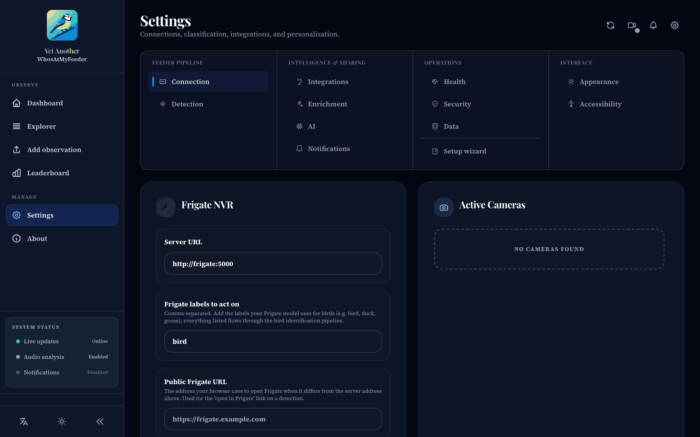
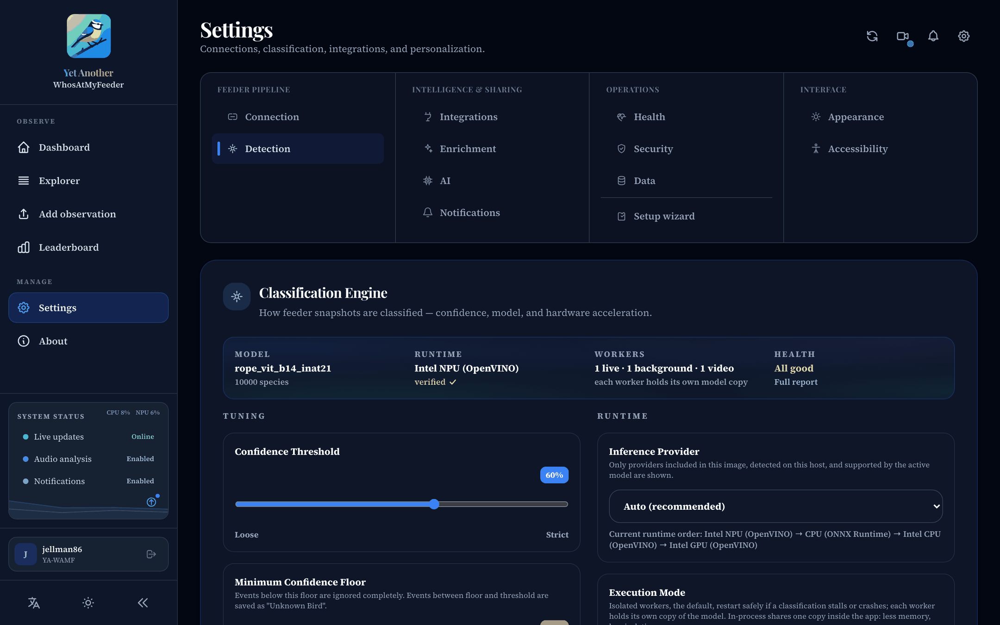
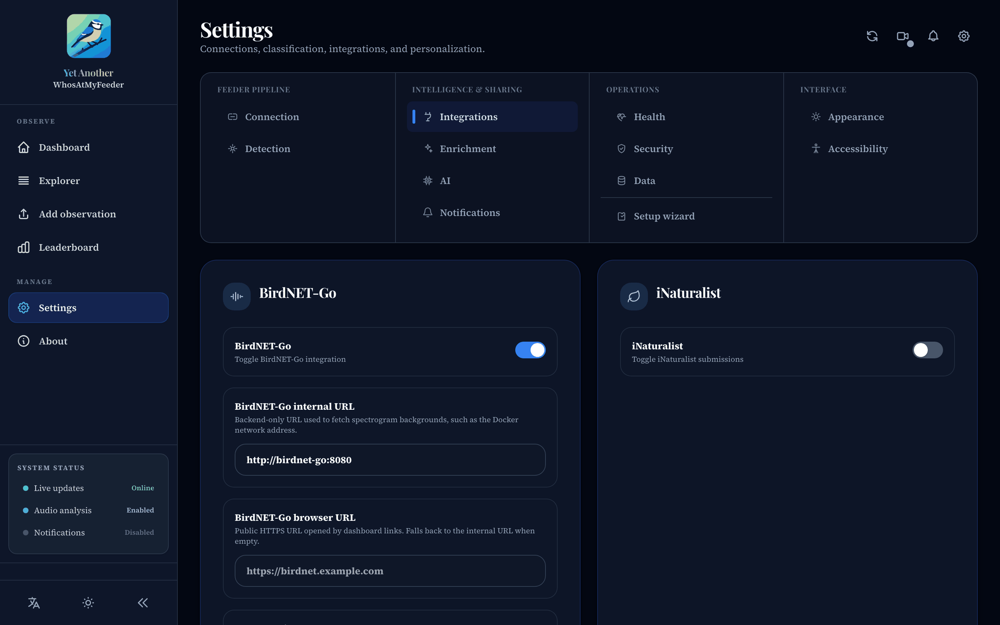
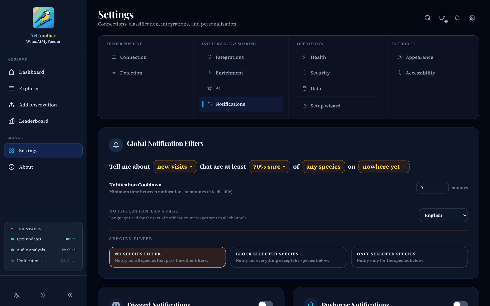
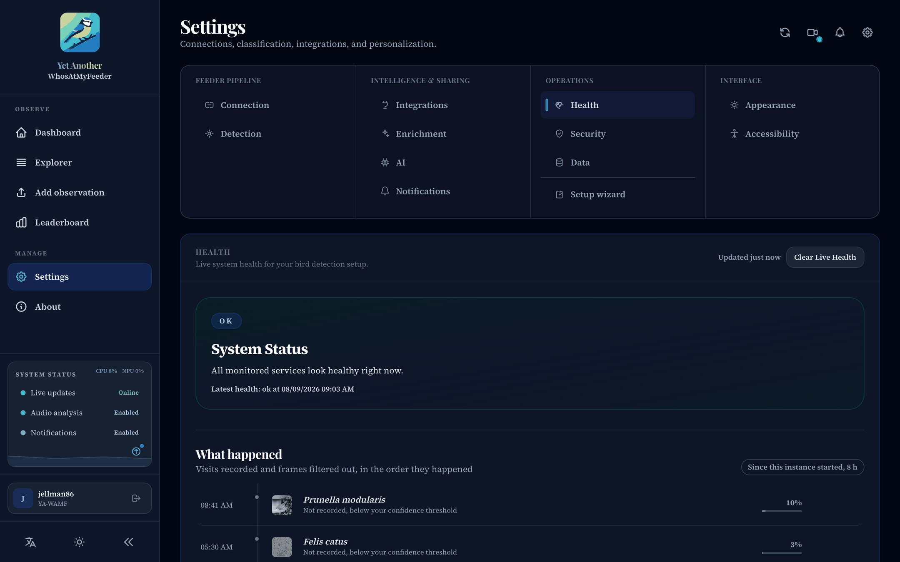
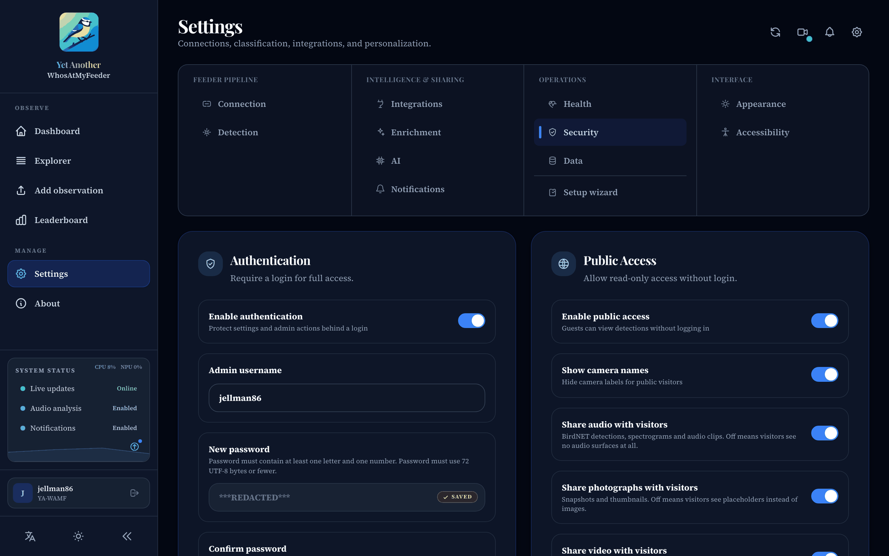

# Configuration

Almost everything about YA-WAMF is configured in the web UI, under **Settings**. Your
choices are written to `/config/config.json` and survive container updates.

> Every UI setting that can be pre-set at deploy time also has an environment
> variable. For the **complete list of environment variables** (names, defaults,
> and what's UI/file-only), see
> [Environment variables](environment-variables.md).

## How Settings is laid out

Settings has twelve sections in four groups. The same grid appears at the top of every
Settings page, so you can jump between sections without going back:

| Group | Sections | What lives there |
|---|---|---|
| **Feeder pipeline** | Connection, Detection | Where events come from, and how they are identified. |
| **Intelligence & sharing** | Integrations, Enrichment, AI, Notifications | Other services YA-WAMF talks to, and what it sends out. |
| **Operations** | Health, Security, Data, Setup wizard | Running it: diagnostics, access, retention, and re-running setup. |
| **Interface** | Appearance, Accessibility | How the app looks and reads for you. |

A **Debug** section appears alongside them when debug UI is enabled (see
[Debug section](#debug-section)).

Edits are staged. An **Unsaved Changes** bar appears at the bottom of the page until you
select **Apply settings**; nothing reaches `config.json` before then.

---

## Connection

Where bird events come from.

| Setting | Description |
|---------|-------------|
| **Server URL** | The address YA-WAMF uses to reach Frigate for snapshots and clips, for example `http://frigate:5000`. |
| **Frigate labels to act on** | Comma-separated Frigate labels that should enter the bird pipeline. Defaults to `bird`. |
| **Public Frigate URL** | The address *your browser* uses to open Frigate, when it differs from the server address above. Used for the "open in Frigate" link on a detection. |
| **Active Cameras** | Which Frigate cameras YA-WAMF monitors. **Sync Cameras** pulls the list from Frigate; **Preview** shows a live snapshot through the Frigate proxy. |
| **Camera role** | Mark each camera as a **feeder** or a **nest** camera. Nest cameras use their own de-duplication window. |
| **MQTT Broker** / **Port** / **Use Authentication** | Under **MQTT Settings (Frigate Events)**: your broker's hostname, its port (default `1883`), and optional user and pass. |
| **Fetch video clips** | Whether YA-WAMF caches Frigate's short event clip. Turn it off on a metered link. |
| **Full-visit clips** | Ask Frigate for a wider window of recording around each detection. The default window is `30` seconds before and `90` seconds after. |
| **Telemetry** | Optional anonymous usage metrics and health diagnostics, both off by default. See [Telemetry](../features/telemetry.md). |
| **Test Connection** | One staged diagnostic with two checks: **Frigate API**, then **MQTT broker publish**. It tests the values currently in the form, so you can prove a change before saving it. |

> **Full-visit clips need continuous recording.** Every selected camera needs an enabled
> FFmpeg `record` role and positive `record.continuous.days` retention. Alert or detection
> retention alone can leave the start or end of the requested window missing. Settings
> checks this coverage and names any camera that needs attention.

## Detection

How a snapshot becomes a species. This is the section that balances accuracy against noise.

| Setting | Default | Description |
|---------|---------|-------------|
| **Confidence Threshold** | `0.7` | The species gatekeeper. At or above this score the detection is saved with its species name. |
| **Minimum Confidence Floor** | `0.4` | The existence gatekeeper. Below this score the event is ignored completely. |
| **Trust Frigate Sublabels** | Enabled | Accept a species Frigate has already identified when local inference has nothing usable. |
| **Write Frigate Sublabel** | Enabled | Push YA-WAMF's own identification back to the Frigate event as a sublabel. |
| **Bird Model Region** | `Auto` | Override regional model selection (`Auto`, `Europe`, `North America`) for birds-only model families. |
| **Inference Provider** | `Auto` | `Auto`, `CPU`, `NVIDIA CUDA`, `Intel GPU (OpenVINO)`, `Intel CPU (OpenVINO)`, or `Intel NPU (OpenVINO)`. Only providers your image packages, your host exposes, and the active model supports are listed. |
| **Execution Mode** | `Subprocess` | `Subprocess` runs inference in isolated workers the app can restart, so a stalled or crashed classification cannot take the interface with it. `In-process` shares one model copy with the app: less memory, but heavy inference competes with the UI. |
| **Model Manager** | — | Download, validate, and activate classifier models, and the separate cropped-thumbnail detectors. |
| **Runtime diagnostics** | — | **Image**, **Packaged**, **Selected**, **Active**, device probes, backend, and any fallback reason. |
| **Auto Video Analysis** | Disabled | Analyse the clip across multiple frames after the event ends. Frame count defaults to `15`. |
| **Personalized Re-ranking** | Disabled | Use your manual corrections to re-rank future predictions for the same camera and model. |

### 🛠 How the two thresholds work together

1. **Score at or above the Threshold**
   *Saved as the identified species, and reported onward to BirdWeather and Home Assistant.*
2. **Score between the Floor and the Threshold**
   *Saved as **Unknown Bird**.* YA-WAMF is confident something was there, but not confident
   enough to name it. The visit is kept; your species statistics stay clean.
3. **Score below the Floor**
   *Discarded.* Almost always a shadow, an insect, or an unusable frame.

### 🎯 Personalized re-ranking details

- **Scope:** feedback is isolated by **camera + active model ID**. Corrections on one camera or
  model never affect another.
- **Activation:** re-ranking stays inactive until at least **20** manual corrections exist for
  that camera/model pair.
- **Time decay:** newer corrections outweigh older ones, so stale patterns fade.
- **Safety:** adjustments are bounded and fail open. If feedback is unavailable, YA-WAMF uses
  the base classifier scores.

> **A downloaded model is not yet a proven one.** A model that has never been validated on
> this host shows **Validate to enable** instead of **Use this model**, and the API refuses to
> activate it. See [AI Models & Performance](../features/ai-models.md).

## Integrations

Other services YA-WAMF talks to. Credentials are redacted as `***REDACTED***` once saved, and
a saved credential can be re-tested without typing it again.

- **BirdNET-Go** — the audio **MQTT Topic** (default `birdnet/text`), two URLs, the audio buffer
  and match window, and **BirdNET Source Mapping (Optional)**, which ties each audio source to a
  Frigate camera. **BirdNET-Go internal URL** is the address the backend uses to fetch
  spectrograms (usually the Docker network name); **BirdNET-Go browser URL** is the public
  address dashboard links open, and falls back to the internal one when empty. **Test Audio
  detection** runs the broker publish and a mock detection through the real pipeline. See
  [BirdNET-Go](../integrations/birdnet-go.md).
- **BirdWeather** — enter your Station Token to contribute identified detections to the
  community project. **Test connection** sends a mock House Sparrow to your station.
- **eBird** — an API key unlocks nearby and notable sightings, plus the CSV export. The export
  button lives here, under **eBird**, not under Data.
- **iNaturalist** — owner-reviewed submissions over OAuth. Needs App Owner approval from
  iNaturalist first.
- **Home Assistant weather** — take each visit's weather from your own HA instance instead of a
  regional forecast.
- **Location** — your latitude and longitude for weather enrichment, optional `state` and
  `country` values for the eBird export, and **Display Units** (`Metric`, `Imperial`, or
  `British` for °C with mph and mm). Distances elsewhere in the UI follow this choice.

## Enrichment

A read-only summary of which source currently answers each question about a species. It exists
so you can see, in one place, where the description on a species card came from.

| Question | Default source |
|---|---|
| **Summary** | Wikipedia |
| **Taxonomy and common names** | iNaturalist |
| **Nearby sightings** | Disabled |
| **Seasonality** | Disabled |
| **Rarity** | Disabled |
| **External links** | Wikipedia and iNaturalist |

Each source is `wikipedia`, `inaturalist`, `ebird`, or `disabled`. There are no controls on
this page: the choices are made with the `ENRICHMENT__*` environment variables or the
`enrichment` block in `config.json`. `ENRICHMENT__MODE` is `per_enrichment` (the default, one
source per question) or `single` (one source, named by `ENRICHMENT__SINGLE_PROVIDER`, for
everything). See [Environment variables](environment-variables.md).

## AI

Connect a Large Language Model for the naturalist notes on a detection and the chart analysis
on the leaderboard.

- **Provider:** Google Gemini (default), OpenAI, Claude, or OpenRouter.
- **Model:** the UI lists current presets per provider and shows the recommended one.
  OpenRouter also accepts any model ID you type.
- **Test AI Connection:** a staged panel that checks configuration, provider availability,
  vision support, multi-frame admission, and response generation. It sends five generated
  1280×720 frames — the same shape as a real analysis request — so a pass proves the model
  accepts production traffic.
- **Usage:** calls, tokens, and estimated cost per feature, with the reference pricing the
  estimate used.

## Notifications

Where alerts go, and which detections earn one.

The filter reads as a sentence — *Tell me about **new visits** that are at least **70% sure**
of **any species** on **Discord*** — and each highlighted part is a control.

| Control | Default | Description |
|---|---|---|
| **Notification mode** | Standard | `Final-only`, `Standard`, `Realtime`, `Silent`, or `Advanced (custom)` triggers. |
| **Minimum confidence** | `0.7` | Only notify at or above this score. Set it higher than your detection threshold to hear about sure things only. |
| **Audio confirmed only** | Off | Notify only when BirdNET-Go heard the same species at the same time. |
| **Species filter** | No species filter | `No species filter`, `Block selected species`, or `Only selected species`. |
| **Notification cooldown** | `0` minutes | Minimum gap between notifications. `0` disables the cooldown. |
| **Notification language** | English | The language used in message text, independent of the UI language. |
| **Instance address** | _(blank)_ | The address you use to open YA-WAMF. When set, every notification links to the detection it announces; blank means no link. |

Destinations are Discord, Pushover, Telegram, and Email (Gmail/Outlook OAuth or plain SMTP).
See [Notifications](../features/notifications.md) for per-platform setup.

## Health

Live diagnostics for the whole pipeline: system status, what happened to recent frames and why,
inference health, the naming sources behind your species names, and a downloadable diagnostics
bundle.

This is the first place to look when detections stop arriving or the interface feels slow. See
[Diagnostics & Logs](../troubleshooting/diagnostics.md).

## Security

Who can reach YA-WAMF, and what a visitor can see.

- **Authentication** — enable login, set the owner username and password, and choose the
  session lifetime. Saved passwords display as `***REDACTED***` and are preserved when you
  save other settings.
- **Public Access** — a read-only, rate-limited guest view. **Show camera names**, **Share
  audio**, **Share photographs**, and **Share video** are separate switches, all enforced at
  the server. You also choose how far back the public history reaches.
- **Trusted Proxy Hosts** — if you run behind a reverse proxy, list its IPs, CIDR ranges, or
  container/DNS names so client IP addresses are trusted correctly.

> **Enable authentication before you expose YA-WAMF beyond your own network.** The UI and API
> are administrative surfaces. See [Authentication & Access](../features/authentication.md).

### Recommended reverse proxy routing

For the monolithic deployment, route all traffic through a single upstream:

- All YA-WAMF traffic → `yawamf-monalithic:8080`

See the [Reverse Proxy Guide](reverse-proxy.md) for SSE and video clip proxy requirements.

> **Legacy split deployment:** if you still run the older two-container stack, route `/api/*`
> to `yawamf-backend:8000` and `/` to `yawamf-frontend:80`, to avoid a multi-hop proxy chain
> that can break HTTPS detection.

The image flavour is a deployment choice, not an application setting. Use the full
compatibility image or a smaller CPU, Intel, or CUDA image as described in
[Hardware Acceleration](hardware-acceleration.md). Switching image does not rewrite
**Inference Provider**, `/config`, or `/data`.

## Data

Retention, caching, imports, and the destructive tools.

- **Retention Policy** — **History Duration** sets how long sightings are kept
  (`maintenance.retention_days`; **Keep Everything (∞)** is the default). Cleanup runs once at
  startup and then every 24 hours from that point, so the time of day it lands on follows when the
  container last started. **Purge Old Records** runs it now. Cleanup **permanently deletes** both
  visual detections and BirdNET-Go audio older than the window. Purged history cannot be
  recovered. Favourited detections are kept.
  The **Advanced → Maintenance & media integrity** disclosure holds the periodic re-check against
  Frigate and what to do when upstream media has gone.
- **Media Cache** — cache snapshots and clips locally to reduce load on Frigate and speed up
  the UI.
- **Best available event snapshots** — start from Frigate's completed clean best frame and
  tracked-object crop, then sample high-quality clip frames. A clip frame replaces the baseline
  only when a compatible species result improves confidence by at least two points. JPEG quality
  is configurable; crop source selection is automatic.
- **Missed Detections** — import bird events Frigate still retains, over a day, week, month, or a
  custom range. Import is idempotent by Frigate event ID, so running it twice is safe.
- **Batch Analysis** — re-run classification over detections currently saved as Unknown Bird,
  either on demand or automatically each day.
- **Taxonomy Repair** — normalise species names across your whole history against iNaturalist.
  It rewrites names only.
- **Timezone Repair** — owner-only fix for legacy detections affected by a UTC timestamp shift.
  It previews the change first and needs explicit confirmation, and it is only offered when
  affected rows exist.
- **Migration backups** — before applying database migrations YA-WAMF writes a timestamped
  restore point beside `speciesid.db`, keeping the newest 10 by default. Set
  `DB_PRE_MIGRATION_BACKUP_RETENTION` to keep more. At least one restore point is always kept,
  and manual backups are never removed.

> **The Danger Zone is genuinely dangerous.** **Reset Database & Cache** permanently deletes
> *every* detection and clears the media cache; **Clear Personalization Data** deletes every
> manual correction the re-ranker learned from. Both ask first, and neither can be undone. There
> is no automatic backup of your detection history — take your own copy of `/data` before you use
> either.

### Maintenance concurrency

`maintenance_max_concurrent` (default `1`) controls how many jobs of the *same* maintenance
kind may overlap — backfill, weather backfill, video classification, taxonomy repair, timezone
repair, and analyse-unknowns each get that many slots. Different kinds already run
independently. `1` is the recommendation: it keeps maintenance from competing with live event
processing.

Video-analysis concurrency is separate, and no longer has its own setting. It follows the
background worker count (`CLASSIFICATION__BACKGROUND_WORKER_COUNT`) — one clip per worker.
`video_classification_max_concurrent` remains readable and writable for compatibility, but is
ignored.

## Appearance

How the interface reads.

| Setting | Options |
|---|---|
| **Bird Naming Style** | **Standard** (common name primary, scientific subtitle), **Hobbyist** (scientific primary, common subtitle), or **Strictly Scientific** (scientific only). |
| **Explorer view** | **Cards** shows a snapshot per detection; **List** shows one compact row each, with times aligned for scanning. |
| **Theme** | Light or dark, plus the colour and font themes. |
| **Language** | The interface language. Notifications have their own language setting. |
| **Date format** | United Kingdom (DD/MM/YYYY), United States (MM/DD/YYYY), or Japan/China (YYYY-MM-DD). |
| **Time format** | 12 hour, 24 hour, or **Follow browser language**. |

## Accessibility

- **High contrast**, **Dyslexia-friendly font**, and **Reduced motion** for readability and
  motion sensitivity.
- **Live announcements** — screen reader announcements when new detections arrive.

## Setup wizard

Re-runs the guided setup as a non-destructive section map. Completing, skipping, or backing out
of a section returns you to that map rather than marching through unrelated steps.

## Debug section

Optional developer tools, hidden unless you enable them:

- Environment variable: `SYSTEM__DEBUG_UI_ENABLED=true`
- Config file: `"system": { "debug_ui_enabled": true }`
- Compose: `DEBUG_UI_ENABLED=true`

This reveals a **Debug** section in the Settings navigation, holding things like the
iNaturalist preview toggle and the LLM prompt editors.
