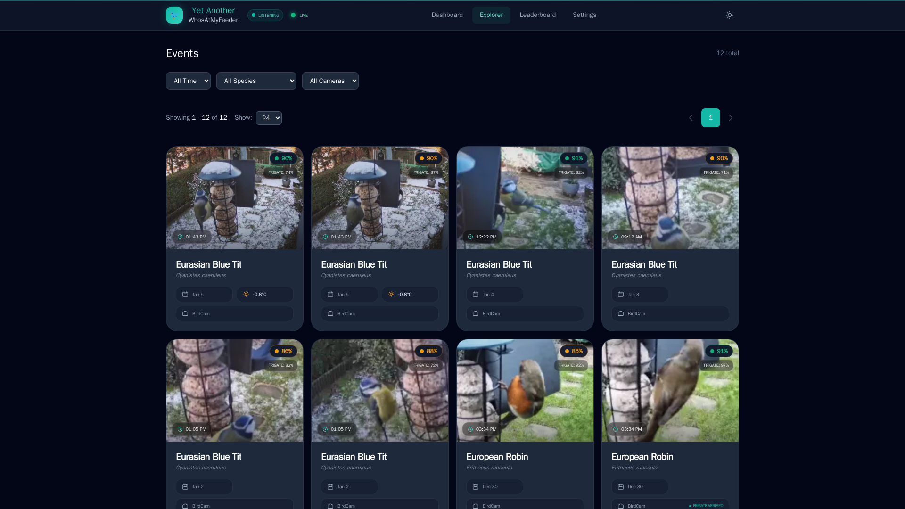

# Getting Started

This guide will walk you through the basic installation of YA-WAMF using Docker Compose.

## Prerequisites
- **Docker & Docker Compose** installed on your host.
- **Frigate NVR** already running and accessible.
- **MQTT Broker** (e.g., Mosquitto) configured and connected to Frigate.

## Quick Install

### 1. Download the core files
Create a directory for YA-WAMF and download the latest compose and example environment files:

```bash
mkdir ya-wamf && cd ya-wamf
curl -O https://raw.githubusercontent.com/Jellman86/YetAnother-WhatAtMyFeeder/dev/docker-compose.yml
curl -O https://raw.githubusercontent.com/Jellman86/YetAnother-WhatAtMyFeeder/dev/.env.example
```

### 2. Configure Environment
Copy the example environment file and edit it with your details:

```bash
cp .env.example .env
nano .env
```

**Key variables to set:**
- `DOCKER_NETWORK`: The name of the Docker network Frigate is using.
- `FRIGATE_URL`: The full URL to your Frigate instance (e.g., `http://192.168.1.10:5000`).
- `MQTT_SERVER`: Your broker's hostname or IP.

### 3. Launch
Start the containers in detached mode:

```bash
docker compose up -d
```

### 4. Verify
Open your browser to `http://<your-ip>:9852`. You should see the dashboard! Once detections start flowing, they will appear in the Events list:



## 🌍 The Importance of Timezone (`TZ`)
Setting your correct local timezone is **critical** for YA-WAMF to function correctly. Ensure `TZ` is set in your `.env` (e.g., `TZ=Europe/London`).

If the timezone is incorrect:
- **Audio correlation will fail:** Visual events from Frigate and Audio events from BirdNET won't align, and birds won't be "Verified".
- **Histogram will be wrong:** The dashboard Activity Pulse will show birds at the wrong hours.
- **Cleanup issues:** The system may prematurely delete recent audio detections.

> 💡 **Tip:** Ensure the same `TZ` value is used for **all** containers in your stack (Frigate, MQTT, BirdNET, and YA-WAMF).

## Data Persistence
YA-WAMF uses two volumes for data:
- `/config`: Stores `config.json` (your settings).
- `/data`: Stores the SQLite database and downloaded ML models.

Ensure these are mapped to persistent storage in your `docker-compose.yml` to avoid data loss during updates.
