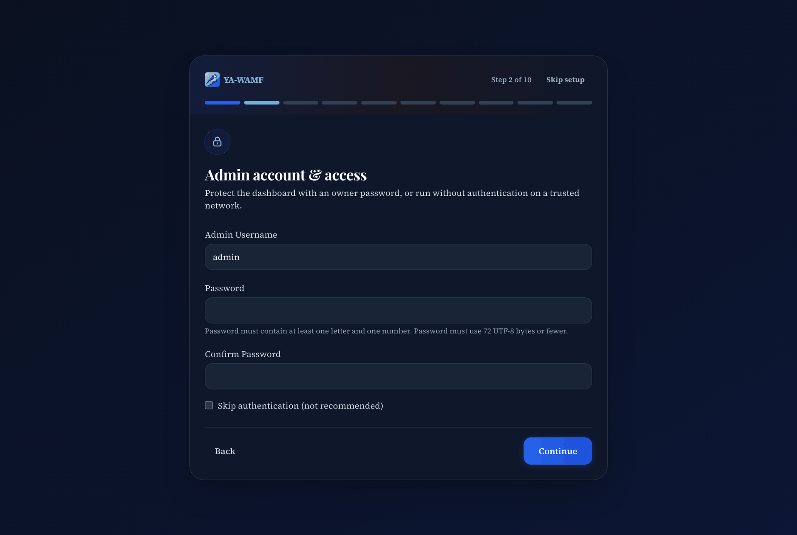
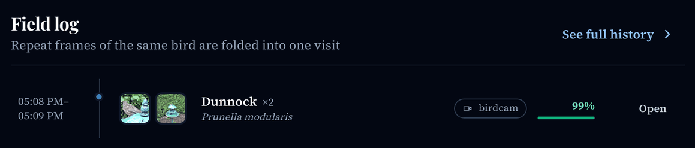
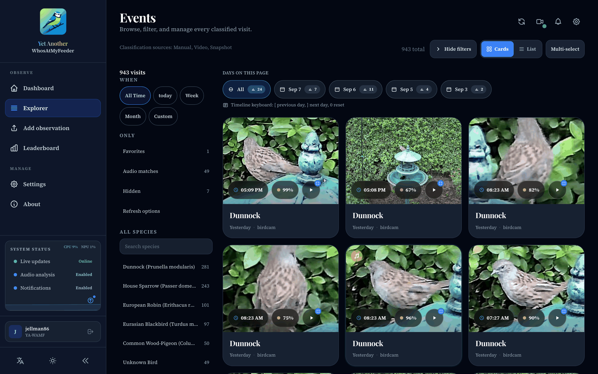

# Getting Started

This guide will walk you through the basic installation of YA-WAMF using Docker Compose.

The recommended deployment uses one container, `ghcr.io/jellman86/yawamf-monalithic`. The older split deployment (`wamf-backend` + `wamf-frontend`) is a legacy path kept for existing installs.

If you are installing on a Raspberry Pi 4/5, use the dedicated ARM64 image flow in [Raspberry Pi Setup](raspberry-pi.md) instead of the default x86-64 image.

## Prerequisites
- **Docker & Docker Compose** installed on your host.
- **Frigate NVR** already running and accessible.
- **MQTT Broker** (e.g., Mosquitto) configured and connected to Frigate.
- **Optional GPU acceleration (ONNX models):**
  - **NVIDIA CUDA:** NVIDIA driver on the host + NVIDIA Container Toolkit installed + GPU passed into the backend container (`gpus: all` or equivalent).
  - **Intel iGPU (OpenVINO):** `/dev/dri` passed into the backend container + correct `/dev/dri` numeric `group_add` values for your host.

## Quick Install

### 1. Download the core files
Create a directory for YA-WAMF and download the latest compose and example environment files:

```bash
mkdir ya-wamf && cd ya-wamf
curl -O https://raw.githubusercontent.com/Jellman86/YetAnother-WhosAtMyFeeder/main/docker-compose.monolith.yml
curl -O https://raw.githubusercontent.com/Jellman86/YetAnother-WhosAtMyFeeder/main/.env.example
```

> [!WARNING]
> This guide uses `docker-compose.monolith.yml` — the **recommended deployment**. The older split deployment (`docker-compose.yml`, `docker-compose.dev.yml`, `docker-compose.prod.yml`) is a legacy path that will receive no further updates starting with v3.0. New installs should use the monolithic container.

### 2. Configure Environment
Copy the example environment file and edit it with your details:

```bash
cp .env.example .env
nano .env
```

Keep `YAWAMF_MONALITHIC_TAG=latest` for the stable release channel. Set it to
`dev` only when you intentionally want development builds. Both unsuffixed tags
use the full compatibility image, so existing installs keep all provider
runtimes. After the first successful start, you may choose a smaller `-cpu`,
`-intel` or `-cuda` tag using the
[hardware-acceleration guide](hardware-acceleration.md).

**Key variables to set:**
- `DOCKER_NETWORK`: The name of the Docker network Frigate is using.
- `FRIGATE_URL`: The full URL to your Frigate instance (e.g., `http://192.168.1.10:5000`).
- `MQTT_SERVER`: Your broker's hostname or IP.
- `PUID` & `PGID`: Your host user's UID and GID (run `id` to find them). This ensures the container has permission to write to your `config/` and `data/` folders.

### 2.1 Non-root permissions (required) 🔐
YA-WAMF runs as non-root. If host directory ownership is wrong, startup fails or data/model writes fail.

Use these exact commands from your stack directory:

```bash
mkdir -p config data
PUID=$(id -u)
PGID=$(id -g)
echo "PUID=$PUID"
echo "PGID=$PGID"
sudo chown -R "$PUID:$PGID" config data
sudo chmod -R u+rwX,g+rwX config data
```

Put these values in `.env`:

```env
PUID=1000
PGID=1000
```

Compose/Portainer stack values should match:

```yaml
services:
  yawamf:
    user: "${PUID}:${PGID}"
    environment:
      - PUID=${PUID}
      - PGID=${PGID}
    volumes:
      - ./config:/config
      - ./data:/data
```

Quick verify:

```bash
docker compose -f docker-compose.monolith.yml exec yawamf sh -lc 'id && ls -ld /config /data && touch /data/.perm_test && rm -f /data/.perm_test'
```

If this fails with `Permission denied`, re-run `chown` on the host path that is actually mounted in your stack.

### 3. Launch
Start the containers in detached mode:

```bash
docker compose -f docker-compose.monolith.yml up -d
```

### 3.1 (Optional) Enable GPU acceleration for ONNX models

If you want ONNX model acceleration (`RoPE ViT-B14`, `ConvNeXt`, `EVA-02`, and the ONNX birds-only models):

- **Intel iGPU (OpenVINO):**
  - Use the default full image or set `YAWAMF_MONALITHIC_TAG=latest-intel`
  - Mount `/dev/dri` into `yawamf`
  - Add `group_add` entries for the host's `/dev/dri` GIDs (check with `ls -ln /dev/dri`)
- **NVIDIA CUDA:**
  - Use the default full image or set `YAWAMF_MONALITHIC_TAG=latest-cuda`
  - Install/configure the NVIDIA Container Toolkit on the host
  - Pass through the NVIDIA GPU to `yawamf` (`gpus: all` in Compose, or your platform's NVIDIA runtime equivalent)
  - Optional quick check after startup:
    ```bash
    docker compose -f docker-compose.monolith.yml exec yawamf python -c "import onnxruntime as ort; print(ort.get_available_providers())"
    ```
    You should see `CUDAExecutionProvider` in the list when the CUDA-capable runtime is available in the container.

After startup, go to **Settings → Detection → Runtime diagnostics** and check:

- `Image` and `Packaged`
- `OpenVINO` / `CUDA` availability badges
- `Selected` versus `Active`
- `Fallback` or an image/provider mismatch warning

See [Hardware Acceleration](hardware-acceleration.md) for the complete image/provider
matrix, [AI Models & Performance](../features/ai-models.md) for provider behavior,
and [Diagnostics & Logs](../troubleshooting/diagnostics.md) for troubleshooting steps.

**Portainer Stacks (common deployment):**
- Create a new Stack from `docker-compose.monolith.yml` (and your `.env`).
- To update later: use "Pull and redeploy" (or redeploy the stack) after bumping image tags (`:latest`, `:dev`, a provider-suffixed variant, or a pinned release tag).

### 4. Verify
Open your browser to `http://<your-ip>:9852`.

A fresh installation opens the guided setup wizard automatically:


In its **Admin account & access** step, set an owner password before exposing YA-WAMF
outside your trusted network.



You may explicitly choose to run without a password on a trusted network. When you
create a password, the same response also signs the browser in, so the newly
protected Settings API remains available for the rest of setup. Completing this
account decision permanently closes the unauthenticated first-run endpoint; later
authentication changes require owner access through **Settings → Security**.

The remaining steps configure Frigate/MQTT, cameras, the classifier and its
verified provider, best-available snapshots, optional integrations, an optional retained-history
import, and telemetry. The history import classifies bird events that Frigate still has and then
continues as a visible background job; you do not need to wait for it before finishing setup. It
cannot recreate BirdNET-Go audio that was never stored by YA-WAMF.
Connection diagnostics use the values currently visible in the form. The final
review distinguishes **Configured**, **Needs attention**, and **Optional**; this
is a credential/configuration summary, not a claim that an external service is
currently online. The wizard can be reopened later from **Settings → Setup wizard**
in the Settings navigation. In re-run mode, completing, skipping, or backing out
of a section returns to that review map instead of advancing through unrelated steps.

**You should see:** the **Dashboard**, with today's counts across the top and the
field log beneath. Until Frigate sends its first bird event the field log is empty
and says so.


#### A word on visits

Frigate can send many frames of one bird standing at one feeder. YA-WAMF folds
those repeats into a single **visit**, which is what the field log, the counts
across the top, and the leaderboard all count:



The `×2` is the number of frames folded into that one visit, and **Open** shows
every frame behind it. Frames of the same species on the same camera more than
ten minutes apart count as separate visits, so a bird that leaves and comes back
is two visits rather than one long one.

Once detections start flowing, every classified visit also appears under
**Explorer** (the page itself is headed **Events**), where you can filter by time
window, species, camera, favourites, and audio matches:



**If nothing appears:** check the MQTT connection in the container logs and confirm
Frigate is publishing to `frigate/events`. See
[Diagnostics & Logs](../troubleshooting/diagnostics.md).

### 5. (Optional) Share a read-only public view
If you want friends to see your feeder without giving them the controls:

1. Go to **Settings → Security**, set a password, and enable **Authentication**.
2. Enable **Public Access**.
3. Choose what a guest can see — camera names, snapshots, clips, and audio are
   separate switches — and set the rate limit and how far back the public history
   reaches.

See [Authentication & Access](../features/authentication.md) for the full guest mode checklist and proxy guidance.

## 🌍 The Importance of Timezone (`TZ`)
Setting your correct local timezone is **critical** for YA-WAMF to function correctly. Ensure `TZ` is set in your `.env` (e.g., `TZ=Europe/London` — the correct choice, obviously).

If the timezone is incorrect:
- **Audio correlation will fail:** Visual events from Frigate and Audio events from BirdNET won't align, and birds won't be "Verified".
- **Histogram will be wrong:** The dashboard Activity Pulse will show birds at the wrong hours.
- **Cleanup issues:** The system may prematurely delete recent audio detections.

> 💡 **Tip:** Ensure the same `TZ` value is used for **all** containers in your stack (Frigate, MQTT, BirdNET, and YA-WAMF).

## Data Persistence
YA-WAMF uses two volumes for data:
- `/config`: Stores `config.json` (your settings).
- `/data`: Stores the SQLite database and downloaded ML models.

Ensure these are mapped to persistent storage in your compose file to avoid data loss during updates.

> 🔒 **Permissions Note:** From v2.5.0+, containers run as non-root. Always set `PUID`/`PGID` and fix host ownership before first boot. See [MIGRATION.md](../../MIGRATION.md) for background context.
